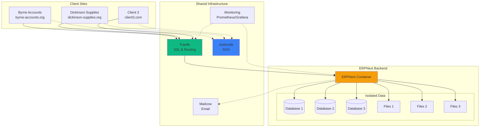
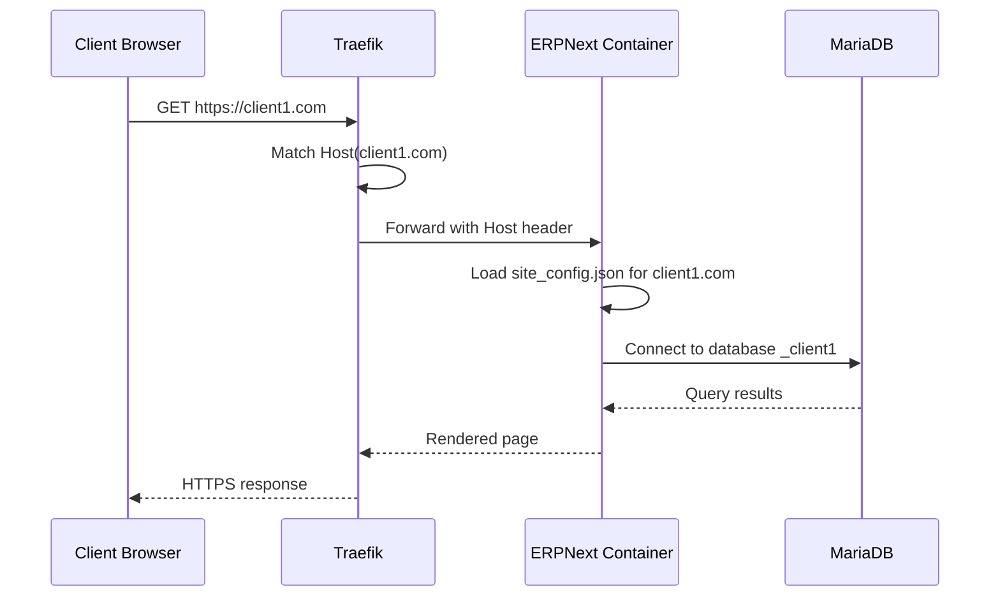

# Client Management Overview

Multi-tenant client onboarding, provisioning, and management.

## Multi-Tenant Architecture



## Client Isolation

### What's Isolated

**Per-client resources**:
- ✅ **Dedicated database**: Separate MariaDB database
- ✅ **Isolated files**: `sites/<domain>/private/` and `sites/<domain>/public/`
- ✅ **Custom domain**: Unique subdomain or full domain
- ✅ **SSL certificate**: Dedicated Let's Encrypt certificate
- ✅ **User base**: Independent user accounts
- ✅ **Email domain**: Dedicated email address (via aliases)
- ✅ **Branding**: Custom logo, colors, themes
- ✅ **Configuration**: Individual `site_config.json`

### What's Shared

**Shared resources** (cost-effective):
- 🔄 **ERPNext container**: Single backend serves all sites
- 🔄 **Redis cache/queue**: Isolated by key prefix
- 🔄 **Traefik proxy**: Routes traffic by hostname
- 🔄 **Authentik SSO**: Shared identity provider (optional per-site)
- 🔄 **Mailcow**: Shared mail server (isolated domains/mailboxes)
- 🔄 **Monitoring**: Centralized metrics and logs

## Client Provisioning

### One-Command Provisioning

**Fastest way** to add a new client:

```bash
./scripts/provision-client-complete.sh \
  --name "Client Name" \
  --subdomain "client"
```

**What it does** (in order):
1. ✅ Creates new ERPNext site
2. ✅ Sets administrator password
3. ✅ Adds Traefik routing labels to compose.yml
4. ✅ Recreates ERPNext container with new labels
5. ✅ Generates SSL certificate (automatic)
6. ✅ Creates Mailcow domain and mailbox
7. ✅ Sets up email alias forwarding
8. ✅ Creates Authentik user account (optional)
9. ✅ Runs post-setup verification

**Time**: ~2-3 minutes per client

**Documentation**: [One Command Provisioning](../ONE_COMMAND_PROVISIONING.md)

### Manual Provisioning

**Step-by-step client setup**:

#### 1. Create ERPNext Site

```bash
docker compose exec erpnext-backend \
  bench new-site client.example.com \
  --admin-password "SecurePass123!" \
  --db-name _client_example \
  --install-app erpnext
```

#### 2. Add Traefik Labels

**Edit `compose.yml`**:

```yaml
erpnext-backend:
  labels:
    # Existing labels...

    # New client site
    - traefik.http.routers.erp-client.rule=Host(`client.example.com`)
    - traefik.http.routers.erp-client.entrypoints=websecure
    - traefik.http.routers.erp-client.tls.certresolver=le
    - traefik.http.routers.erp-client.middlewares=secure-headers@file
    - traefik.http.routers.erp-client.service=erp
    - traefik.http.routers.erp-client-http.rule=Host(`client.example.com`)
    - traefik.http.routers.erp-client-http.entrypoints=web
    - traefik.http.routers.erp-client-http.middlewares=redirect-to-https@file
```

#### 3. Recreate Container

```bash
docker compose up -d erpnext-backend
```

#### 4. Verify SSL Certificate

```bash
# Wait 10-30 seconds for certificate issuance
curl -vI https://client.example.com 2>&1 | grep "SSL certificate verify"
```

#### 5. Create Email Domain

**Via Mailcow UI**:
1. Login to https://mail.securenexus.net
2. Go to Configuration > Mail Setup
3. Add domain: `client.example.com`
4. Create mailbox: `erp@client.example.com`

**Via API**:
```bash
./scripts/mailcow-create-domain.sh client.example.com
./scripts/mailcow-create-mailbox.sh erp@client.example.com
```

#### 6. Configure Site

**Site configuration** (`sites/client.example.com/site_config.json`):

```json
{
  "db_name": "_client_example",
  "db_password": "********",
  "encryption_key": "********",

  "mail_server": "mail.securenexus.net",
  "mail_port": 587,
  "use_tls": 1,
  "mail_login": "erp@client.example.com",
  "mail_password": "********",
  "auto_email_id": "erp@client.example.com"
}
```

#### 7. Complete Setup Wizard

1. Visit `https://client.example.com`
2. Complete ERPNext setup wizard
3. Configure company settings
4. Add users and permissions

**Documentation**: [Complete Client Provisioning Guide](../COMPLETE_CLIENT_PROVISIONING_GUIDE.md)

## Active Client Sites

### Byrne Accounting

**Domain**: `erp.byrne-accounts.org`
**Status**: ✅ Production
**Purpose**: Main client site for Byrne Accounting

**Features**:
- Full ERP system
- Multi-company support
- POS configuration
- Email integration
- Custom branding

**Documentation**:
- [Byrne Accounting Setup](../BYRNE_ACCOUNTING_SETUP.md)
- [Byrne Accounting Summary](../BYRNE_ACCOUNTING_SUMMARY.md)

### Dickinson Supplies

**Domain**: `dickinson-supplies.org` (or subdomain)
**Status**: ✅ Demo/Testing
**Purpose**: Demo site for Dickinson Supplies

**Features**:
- Retail/wholesale configuration
- Custom branding (Dickinson theme)
- SSO integration
- Email configured

**Documentation**:
- [Dickinson Setup Quickstart](../DICKINSON_SETUP_QUICKSTART.md)
- [Dickinson Branding](../DICKINSON_SUPPLIES_BRANDING.md)

### Test Sites

| Site | Purpose | Status |
|------|---------|--------|
| workflow.byrne-accounts.org | Workflow testing | ✅ Active |
| poctest.byrne-accounts.org | PoC testing | 🔧 Development |

## Client Onboarding Process

### Pre-Onboarding

**Information needed**:
- [ ] Client company name
- [ ] Domain or subdomain preference
- [ ] Primary contact email
- [ ] Industry/business type
- [ ] Estimated users
- [ ] Module requirements (inventory, manufacturing, HR, etc.)

### Onboarding Steps

**Timeline**: ~1-2 hours

#### Phase 1: Infrastructure (5 min)

1. Create ERPNext site
2. Add Traefik routing
3. Generate SSL certificate
4. Create email domain and mailbox
5. Verify access

#### Phase 2: ERPNext Setup (30-45 min)

1. Complete setup wizard with client
2. Configure company settings
3. Set up chart of accounts
4. Create user accounts
5. Assign roles and permissions

#### Phase 3: Configuration (15-30 min)

1. Configure POS (if needed)
2. Add warehouses and items
3. Set up price lists
4. Configure print formats
5. Apply custom branding

#### Phase 4: Testing (15-30 min)

1. Create test transactions
2. Verify workflows
3. Test email sending
4. Verify reports
5. Train users

**Documentation**: [Client Onboarding Guide](../CLIENT_ONBOARDING_GUIDE.md)

### Post-Onboarding

**Follow-up tasks**:
- [ ] Schedule training sessions
- [ ] Provide user documentation
- [ ] Set up regular backups
- [ ] Monitor usage and performance
- [ ] Collect feedback

## Proof of Concept

### PoC Testing

**Purpose**: Demonstrate ERPNext capabilities to prospects

**Test site**: `poctest.byrne-accounts.org`

**PoC includes**:
- Pre-configured company
- Sample products and customers
- Demo transactions (quotations, sales orders, invoices)
- Canned reports
- User training data

**Duration**: Typically 2-4 weeks

**Conversion**: Convert PoC site to production or create fresh site

**Documentation**: [Proof of Concept Complete](../PROOF_OF_CONCEPT_COMPLETE.md)

## Multi-Tenant Architecture

### Site Routing

**How Traefik routes** requests to the correct site:



**Key**: ERPNext uses HTTP `Host` header to determine which site to serve

### Database Isolation

**MariaDB databases**:

```sql
SHOW DATABASES;
+-------------------------+
| Database                |
+-------------------------+
| _7b99cd60da13a32d       | -- erp.byrne-accounts.org
| _3f4e2a1c8b9d7e5f       | -- dickinson-supplies.org
| _8a1b2c3d4e5f6g7h       | -- workflow.byrne-accounts.org
| _client_example         | -- client.example.com
+-------------------------+
```

**Database naming**: Hash of domain name or custom name

**Benefits**:
- Complete data isolation
- Independent backups per site
- No cross-site data leakage

### File Storage

**Directory structure**:

```
/home/frappe/frappe-bench/sites/
├── erp.byrne-accounts.org/
│   ├── private/              # Private files (not web-accessible)
│   │   ├── files/           # Uploaded documents
│   │   └── backups/         # Site backups
│   ├── public/               # Public files
│   │   ├── files/           # Web-accessible uploads
│   │   └── build/           # Built assets
│   └── site_config.json      # Site-specific config
│
├── dickinson-supplies.org/
│   ├── private/
│   ├── public/
│   └── site_config.json
│
└── client.example.com/
    ├── private/
    ├── public/
    └── site_config.json
```

## User Management

### Site-Level Users

**Each site has independent users**:

- User accounts are **not shared** between sites
- Same email can have different accounts on different sites
- Permissions and roles are site-specific

**Create user** (per-site):

```bash
# Via ERPNext UI
1. Go to User
2. Click "New"
3. Fill email, full name, roles
4. Send welcome email

# Via bench
docker compose exec erpnext-backend \
  bench --site client.example.com add-system-manager admin@client.com
```

### SSO Integration

**Optional**: Integrate with Authentik SSO

**Benefits**:
- Single login across all sites
- Centralized user management
- Automatic user provisioning
- Better security (MFA)

**Limitation**: Users can access all sites (requires role mapping)

**Documentation**: [ERPNext SSO Setup](../ERPNEXT_SSO_SETUP.md)

## Email Configuration

### Per-Client Email

**Email addresses**:
- `erp@client.example.com` - Main ERPNext email
- `noreply@client.example.com` - Automated emails
- `support@client.example.com` - Support tickets (optional)

### Mailcow Domain Setup

**For each client**:

1. Add domain in Mailcow
2. Create mailboxes
3. Configure SPF/DKIM/DMARC
4. Update ERPNext site_config.json
5. Test email sending

### Email Aliases

**Use aliases** for department emails:

- `sales@client.com` → `erp@client.com`
- `support@client.com` → `erp@client.com`
- `info@client.com` → `erp@client.com`

**Documentation**: [Client Email Setup Guide](../CLIENT_EMAIL_SETUP_GUIDE.md)

## Monitoring

### Per-Site Metrics

**Track per-site**:
- Request rate
- Response time
- Error rate
- Database queries
- Active users
- Storage usage

**Grafana queries**:

```promql
# Requests per site
sum by (host) (rate(traefik_entrypoint_requests_total[5m]))

# Response time by site
histogram_quantile(0.95,
  sum by (host, le) (rate(traefik_entrypoint_request_duration_seconds_bucket[5m]))
)
```

### Resource Usage

**Monitor**:
- Total MariaDB size
- Per-site database size
- File storage per site
- Memory usage (shared)
- CPU usage (shared)

```bash
# Check database sizes
docker compose exec mariadb mysql -e "
SELECT
  table_schema AS 'Database',
  ROUND(SUM(data_length + index_length) / 1024 / 1024, 2) AS 'Size (MB)'
FROM information_schema.tables
WHERE table_schema LIKE '\\_%'
GROUP BY table_schema
ORDER BY SUM(data_length + index_length) DESC;
"
```

## Billing & Accounting

### Usage Tracking

**Track per-client**:
- Monthly active users
- Storage consumed
- Email sent
- API requests
- Support tickets

### Billing Models

**Options**:

1. **Per-user pricing**: $X per user per month
2. **Flat rate**: $Y per site per month
3. **Tiered pricing**: Based on features/limits
4. **Usage-based**: Based on storage, transactions, etc.

### Implementation

**Future**: Integrate with ERPNext itself for billing automation

## Security

### Client Data Protection

**Measures**:
- Database-level isolation
- File system isolation
- Encrypted backups
- SSL/TLS encryption
- Access logging

### Compliance

**GDPR/Privacy**:
- Data export per site
- Data deletion on request
- Privacy policy per client
- Audit trails

## Backup & Recovery

### Per-Site Backups

```bash
# Backup specific site
docker compose exec erpnext-backend \
  bench --site client.example.com backup --with-files

# Restore specific site
docker compose exec erpnext-backend \
  bench --site client.example.com restore /path/to/backup.sql --with-files
```

### Automated Backups

**Daily backups** include all sites:

```bash
# All-site backup (part of daily backup job)
docker compose exec erpnext-backend bench backup-all-sites
```

**Retention**: 7 daily / 4 weekly / 12 monthly

## Client Offboarding

### Data Export

**Before removal**:

1. Export all data (invoices, customers, items)
2. Backup database and files
3. Provide data to client
4. Document removal

### Site Removal

```bash
# Drop site (WARNING: Permanent!)
docker compose exec erpnext-backend \
  bench drop-site client.example.com --root-password <mysql-root-password>

# Remove Traefik labels from compose.yml
# Remove Mailcow domain
# Remove SSL certificate (automatic)
```

## Best Practices

### Naming Conventions

**Domains**:
- Subdomain: `clientname.byrne-accounts.org`
- Full domain: `erp.clientdomain.com`

**Consistency**: Choose one pattern and stick to it

### Resource Allocation

**Plan for growth**:
- Estimate users per client
- Project storage needs
- Monitor and adjust limits
- Scale infrastructure proactively

### Client Communication

**Onboarding**:
- Set expectations clearly
- Provide training materials
- Offer ongoing support
- Regular check-ins

## Quick Reference

### Provisioning Commands

```bash
# One-command provisioning
./scripts/provision-client-complete.sh --name "Client" --subdomain "client"

# Manual site creation
docker compose exec erpnext-backend bench new-site client.com --install-app erpnext

# List all sites
docker compose exec erpnext-backend bench --site all list-apps

# Site backup
docker compose exec erpnext-backend bench --site client.com backup --with-files

# Site restore
docker compose exec erpnext-backend bench --site client.com restore backup.sql
```

## Next Steps

- **[Client Onboarding Guide](../CLIENT_ONBOARDING_GUIDE.md)**: Detailed onboarding process
- **[One Command Provisioning](../ONE_COMMAND_PROVISIONING.md)**: Fast client setup
- **[Byrne Multitenant Architecture](../BYRNE_MULTITENANT_ARCHITECTURE.md)**: Architecture deep dive
- **[Email Setup](../email/overview.md)**: Configure client email
