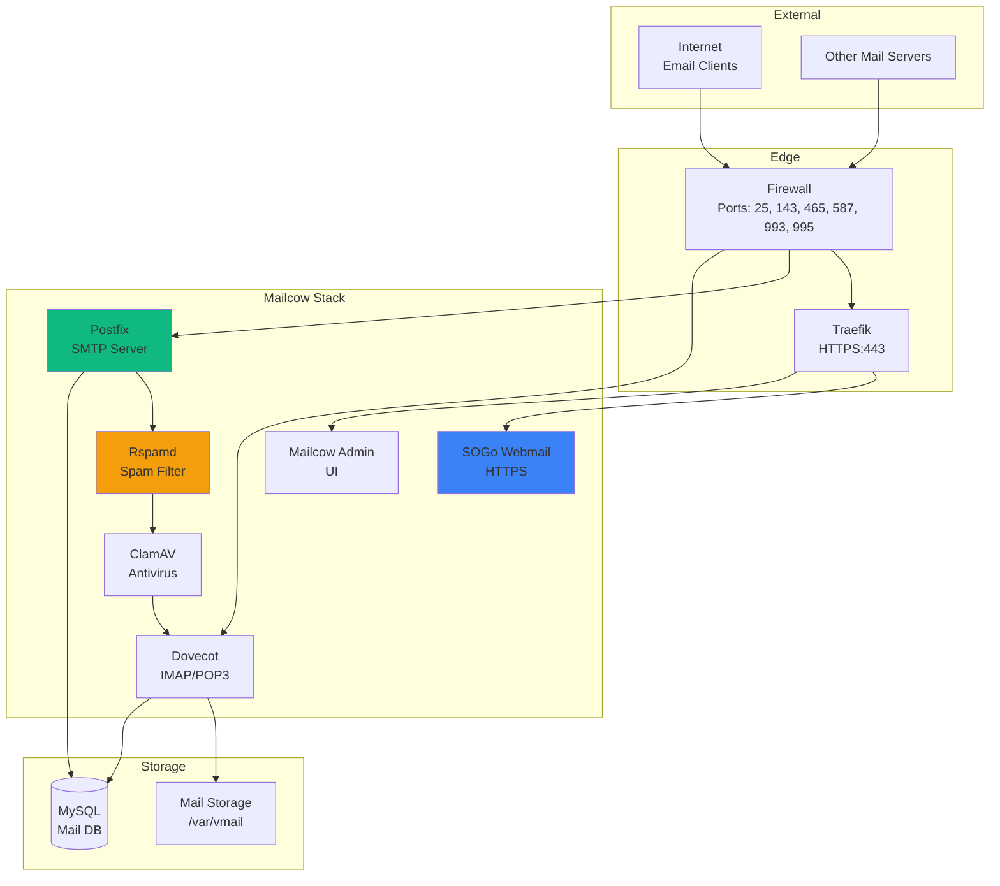

# Email & Communication Overview

Complete email infrastructure with Mailcow, client email setup, and integration guides.

## Email Architecture



## Mailcow Email Server

### What is Mailcow?

Mailcow is a comprehensive, open-source email server providing:

- **SMTP Server**: Postfix for sending/receiving email
- **IMAP/POP3**: Dovecot for email retrieval
- **Webmail**: SOGo for web-based email access
- **Spam Filtering**: Rspamd with machine learning
- **Antivirus**: ClamAV for malware scanning
- **Admin Interface**: Web-based management
- **API**: RESTful API for automation

### Installation

Mailcow is installed **separately** from the main Docker Compose stack:

**Location**: `/home/tristian/securenexus-fullstack/mail/mailcow-dockerized/`

**Installation**:
```bash
cd mail/
git clone https://github.com/mailcow/mailcow-dockerized
cd mailcow-dockerized
./generate_config.sh

# Edit configuration
nano mailcow.conf

# Start Mailcow
docker compose up -d
```

### Mailcow Ports

| Port | Service | Protocol |
|------|---------|----------|
| 25 | SMTP | TCP |
| 143 | IMAP | TCP |
| 465 | SMTPS (Submission) | TCP |
| 587 | Submission | TCP |
| 993 | IMAPS | TCP |
| 995 | POP3S | TCP |
| 4190 | Sieve | TCP |

**Web Access**: `https://mail.securenexus.net`

**Default Credentials**:
- Username: `admin`
- Password: `moohoo` (change immediately!)

### DNS Requirements

**Required DNS records**:

```dns
; MX record
@   IN  MX  10  mail.securenexus.net.

; A record for mail server
mail  IN  A   <server-ip>

; SPF record
@   IN  TXT  "v=spf1 mx ~all"

; DMARC record
_dmarc  IN  TXT  "v=DMARC1; p=quarantine; rua=mailto:postmaster@securenexus.net"

; DKIM (generated by Mailcow)
dkim._domainkey  IN  TXT  "v=DKIM1; k=rsa; p=<public-key>"
```

**Generate DKIM**:
1. Login to Mailcow admin
2. Go to Configuration > Mail Setup
3. Click "DKIM" tab
4. Generate DKIM key
5. Copy TXT record to DNS

## Client Email Setup

### Email Domain Configuration

Each client can have:

1. **Primary domain**: `@example.com`
2. **Subdomain**: `@erp.byrne-accounts.org`
3. **Alias domain**: `@mail.example.com`

### Creating Client Mailboxes

**Via Mailcow UI**:
1. Login to https://mail.securenexus.net
2. Go to "Mailboxes"
3. Click "Add mailbox"
4. Fill in details:
   - Username: `info@example.com`
   - Full name: `Example Company`
   - Quota: 10 GB
   - Password: (auto-generate or custom)
5. Click "Add"

**Via Mailcow API**:
```bash
# Get API key
./scripts/mailcow-get-api-key.sh

# Create mailbox via API
curl -X POST "https://mail.securenexus.net/api/v1/add/mailbox" \
  -H "X-API-Key: <api-key>" \
  -H "Content-Type: application/json" \
  -d '{
    "local_part": "info",
    "domain": "example.com",
    "name": "Example Company",
    "quota": "10240",
    "password": "SecurePass123!",
    "password2": "SecurePass123!"
  }'
```

**Documentation**: [Mailcow API Setup](../MAILCOW_API_SETUP.md)

### Email Aliases

**Create alias**:
1. Go to "Mailboxes" > "Aliases"
2. Click "Add alias"
3. Configure:
   - Alias: `sales@example.com`
   - Goto: `info@example.com`
4. Click "Add"

**Use Cases**:
- Department emails (sales@, support@, info@)
- Role-based addresses (admin@, postmaster@)
- Temporary addresses for campaigns

### Email Forwarding

**Forward to external address**:
1. Go to mailbox settings
2. Add "Forward to" address: `external@gmail.com`
3. Choose:
   - Keep copy in mailbox: Yes/No
   - Forward only: Yes/No

### Documentation

- [Client Email Setup Guide](../CLIENT_EMAIL_SETUP_GUIDE.md)

## Webmail Access

### SOGo Webmail

**Access**: `https://mail.securenexus.net/SOGo/`

**Features**:
- Email reading and composition
- Calendar and contacts
- Shared calendars
- ActiveSync support
- Mobile-responsive interface

### SSO Integration Challenges

**Current Status**: Native Mailcow authentication

**SSO Complexity**:
- SOGo doesn't support OIDC natively
- Requires custom authentication module
- Complex integration with Authentik
- Alternative: Use native authentication

**Documentation**:
- [SnappyMail SSO Setup](../SNAPPYMAIL_SSO_SETUP.md) (alternative webmail)
- [Webmail SSO Complexity](../WEBMAIL_SSO_COMPLEXITY_EXPLAINED.md)
- [SSO Webmail Alternatives](../SSO_WEBMAIL_ALTERNATIVES.md)

### Alternative Webmail: SnappyMail

**SnappyMail** is a lighter alternative with potential SSO support:

**Features**:
- Modern, fast interface
- Multi-account support
- Plugin system
- Lower resource usage

**Limitations**:
- SSO integration still complex
- No calendar/contacts

## ERPNext Email Integration

### SMTP Configuration

**In ERPNext** (`site_config.json` or via UI):

```json
{
  "mail_server": "mail.securenexus.net",
  "mail_port": 587,
  "use_tls": 1,
  "mail_login": "erp@byrne-accounts.org",
  "mail_password": "********",
  "auto_email_id": "erp@byrne-accounts.org",
  "always_use_account_email_id_as_sender": 0
}
```

**Setup in ERPNext**:
1. Go to Settings > Email Domain
2. Add new Email Domain:
   - Domain: `byrne-accounts.org`
   - SMTP Server: `mail.securenexus.net`
   - Port: `587`
   - Use TLS: ✓
3. Add Email Account:
   - Email: `erp@byrne-accounts.org`
   - Password: (mailbox password)
   - Default Outgoing: ✓

### IMAP Configuration

**For incoming email** (support tickets, lead capture):

```json
{
  "email_sync_option": "IMAP",
  "imap_server": "mail.securenexus.net",
  "imap_port": 993,
  "use_ssl": 1
}
```

**Use Cases**:
- Support ticket creation from email
- Lead generation from email
- Email-to-issue conversion

### Email Subdomain Setup

**Dedicated email subdomain** for ERPNext:

Example: `erp@byrne-accounts.org` instead of `noreply@byrne-accounts.org`

**Benefits**:
- Professional appearance
- Better deliverability
- Separate reputation
- Easy filtering

**Documentation**: [ERPNext Email Subdomain Setup](../ERPNEXT_EMAIL_SUBDOMAIN_SETUP.md)

### Integration Documentation

- [ERPNext Mailcow Integration](../ERPNEXT_MAILCOW_INTEGRATION.md)

## Email Security

### Spam Filtering (Rspamd)

**Features**:
- Bayesian filtering
- SPF/DKIM/DMARC validation
- Greylisting
- URL filtering
- Machine learning

**Access**: `https://mail.securenexus.net/rspamd/`

**Configuration**:
1. Login with Mailcow credentials
2. View spam statistics
3. Adjust spam thresholds
4. Manage blacklists/whitelists

### Antivirus (ClamAV)

**Features**:
- Real-time virus scanning
- Automatic signature updates
- Quarantine infected emails

**Status Check**:
```bash
# Check ClamAV container
docker ps | grep clamd

# View virus database version
docker logs mailcow-clamd | grep "Database"
```

### DKIM Signing

**DKIM** (DomainKeys Identified Mail) authenticates email origin:

**Setup**:
1. Generate DKIM key in Mailcow
2. Copy public key
3. Add TXT record to DNS:
   ```
   dkim._domainkey  IN  TXT  "v=DKIM1; k=rsa; p=<public-key>"
   ```
4. Verify with: `dig TXT dkim._domainkey.securenexus.net`

### SPF Record

**SPF** (Sender Policy Framework) prevents spoofing:

```dns
@   IN  TXT  "v=spf1 mx ip4:<server-ip> ~all"
```

**Validation**:
```bash
dig TXT securenexus.net | grep spf1
```

### DMARC Policy

**DMARC** (Domain-based Message Authentication):

```dns
_dmarc  IN  TXT  "v=DMARC1; p=quarantine; rua=mailto:postmaster@securenexus.net; pct=100"
```

**Policies**:
- `p=none` - Monitor only
- `p=quarantine` - Mark as spam
- `p=reject` - Reject email

## SSL Certificates

### Certificate Management

Mailcow uses **its own SSL certificates** or can use Traefik's:

**Option 1: Mailcow Built-in** (recommended for standalone)
```bash
# Auto-generated via Mailcow
# Location: /opt/mailcow-dockerized/data/assets/ssl/
```

**Option 2: Sync from Traefik**
```bash
# Sync Traefik certificates to Mailcow
./scripts/update-mailcow-certs.sh
```

**Manual Update**:
```bash
cd /opt/mailcow-dockerized
docker compose restart nginx-mailcow
```

## Monitoring

### Email Metrics

**Via Mailcow UI**:
- Sent/received mail count
- Queue status
- Spam/virus statistics
- Disk usage

**Via Prometheus** (if integrated):
- Mail queue length
- Delivery times
- Error rates
- Connection counts

### Log Analysis

```bash
# Postfix logs (SMTP)
docker logs mailcow-postfix-mailcow

# Dovecot logs (IMAP/POP3)
docker logs mailcow-dovecot-mailcow

# Rspamd logs (spam filtering)
docker logs mailcow-rspamd-mailcow

# SOGo logs (webmail)
docker logs mailcow-sogo-mailcow
```

### Mail Queue

**Check queue**:
```bash
# View queue
docker exec mailcow-postfix-mailcow postqueue -p

# Flush queue
docker exec mailcow-postfix-mailcow postqueue -f

# Delete queue
docker exec mailcow-postfix-mailcow postsuper -d ALL
```

## Backup & Restore

### Mailcow Backup

**Built-in backup**:
```bash
cd /opt/mailcow-dockerized
./helper-scripts/backup_and_restore.sh backup all
```

**What's backed up**:
- MySQL database (mailboxes, domains, aliases)
- Mail data (/var/vmail/)
- Redis data
- Rspamd data
- Crypt data
- DKIM keys

**Restore**:
```bash
./helper-scripts/backup_and_restore.sh restore
```

### Automated Backups

**Cron job**:
```bash
# Add to crontab
0 3 * * * cd /opt/mailcow-dockerized && ./helper-scripts/backup_and_restore.sh backup all
```

**Retention**: Configure in helper script

## Troubleshooting

### Email Not Sending

**Check**:
1. SMTP port open (25, 587): `telnet mail.securenexus.net 587`
2. SMTP credentials correct
3. Postfix logs: `docker logs mailcow-postfix-mailcow`
4. Mail queue: `docker exec mailcow-postfix-mailcow postqueue -p`

### Email Not Receiving

**Check**:
1. MX record correct: `dig MX securenexus.net`
2. Port 25 open: `telnet mail.securenexus.net 25`
3. Postfix accepting mail: `docker logs mailcow-postfix-mailcow | grep NOQUEUE`
4. Rspamd not blocking: Check Rspamd UI

### Webmail Not Loading

**Check**:
1. SOGo container running: `docker ps | grep sogo`
2. Nginx proxy configuration
3. Browser console for errors
4. SOGo logs: `docker logs mailcow-sogo-mailcow`

### High Spam Score

**Improve deliverability**:
1. Configure SPF, DKIM, DMARC correctly
2. Ensure reverse DNS (PTR) record
3. Check IP reputation: `https://mxtoolbox.com/blacklists.aspx`
4. Warm up IP address gradually
5. Avoid spam trigger words

## Best Practices

### Email Hygiene

- **Validate recipients** before sending bulk email
- **Use double opt-in** for mailing lists
- **Monitor bounce rates**
- **Clean inactive subscribers**
- **Respect unsubscribe requests**

### Security

- **Change default passwords** immediately
- **Enable 2FA** for admin accounts
- **Limit admin access** to necessary users
- **Monitor failed login attempts**
- **Keep Mailcow updated**

### Performance

- **Regular database optimization**
- **Clean old logs** periodically
- **Monitor disk usage** (/var/vmail/)
- **Adjust Rspamd** for your traffic
- **Use SSD** for mail storage

## Quick Reference

### Common Tasks

```bash
# Add domain
curl -X POST "https://mail.securenexus.net/api/v1/add/domain" \
  -H "X-API-Key: <key>" \
  -d '{"domain":"example.com"}'

# Add mailbox
curl -X POST "https://mail.securenexus.net/api/v1/add/mailbox" \
  -H "X-API-Key: <key>" \
  -d '{"local_part":"user","domain":"example.com","password":"pass"}'

# Add alias
curl -X POST "https://mail.securenexus.net/api/v1/add/alias" \
  -H "X-API-Key: <key>" \
  -d '{"address":"alias@example.com","goto":"user@example.com"}'

# Get mailbox info
curl "https://mail.securenexus.net/api/v1/get/mailbox/user@example.com" \
  -H "X-API-Key: <key>"
```

## Next Steps

- **[Client Email Setup](../CLIENT_EMAIL_SETUP_GUIDE.md)**: Configure email for new clients
- **[ERPNext Integration](../erpnext/overview.md)**: Connect ERPNext to email
- **[Security Hardening](../security/overview.md)**: Secure email infrastructure
- **[Monitoring](../monitoring/overview.md)**: Track email metrics
