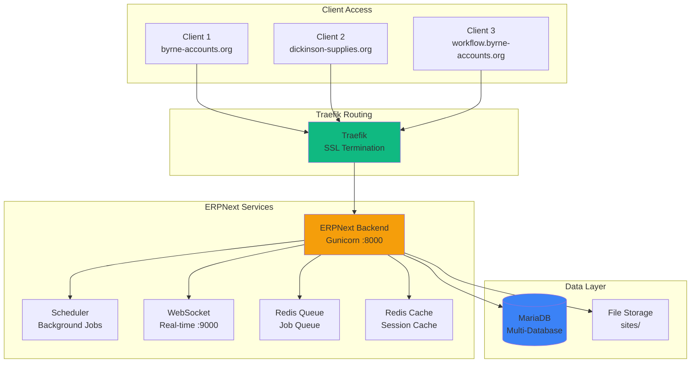
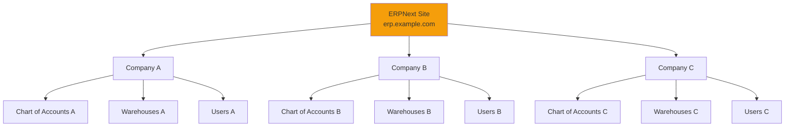

# ERPNext Overview

Complete guide to ERPNext deployment, configuration, and multi-tenant architecture.

## What is ERPNext?

ERPNext is a comprehensive, open-source ERP (Enterprise Resource Planning) system built on the Frappe Framework, providing:

- **Accounting & Finance**: Chart of accounts, invoicing, payments, financial reports
- **Sales & CRM**: Leads, opportunities, quotations, sales orders
- **Inventory**: Stock management, warehouses, serial/batch tracking
- **Point of Sale (POS)**: Retail POS interface with receipt printing
- **HR & Payroll**: Employee records, attendance, leave, payroll
- **Manufacturing**: Bill of materials, work orders, production planning
- **Projects**: Project management, timesheets, tasks
- **Website & E-Commerce**: Content management, online store
- **Reports & Dashboards**: Business intelligence and analytics

## SecureNexus ERPNext Architecture



## Multi-Tenant Architecture

### Site Structure

Each client gets a **dedicated ERPNext site** with isolated:

- **Database**: Separate MariaDB database
- **Files**: Isolated file storage in `sites/<domain>/`
- **Configuration**: Custom site_config.json
- **Users**: Independent user base
- **Branding**: Custom logos, colors, themes

**Shared Resources**:
- Single ERPNext container (cost-effective)
- Common codebase (easier updates)
- Shared Redis (isolated by prefix)

### Active Sites

| Site | Status | Purpose |
|------|--------|---------|
| erp.byrne-accounts.org | ✅ Production | Main client site |
| dickinson-supplies.org | ✅ Demo | Demo/testing |
| workflow.byrne-accounts.org | ✅ Test | Workflow testing |
| poctest.byrne-accounts.org | 🔧 Development | PoC testing |

### Site Provisioning

**Automated provisioning** via script:

```bash
# One-command client provisioning
./scripts/provision-client-complete.sh \
  --name "Client Name" \
  --subdomain "client"
```

**What it does**:
1. Creates new ERPNext site
2. Installs custom apps (if any)
3. Sets administrator password
4. Adds Traefik routing labels
5. Generates SSL certificate
6. Configures email domain
7. Sets up user accounts

**Documentation**:
- [One Command Provisioning](../ONE_COMMAND_PROVISIONING.md)
- [Client Onboarding Guide](../CLIENT_ONBOARDING_GUIDE.md)
- [Complete Provisioning Guide](../COMPLETE_CLIENT_PROVISIONING_GUIDE.md)

## ERPNext Components

### Backend (Gunicorn)

**Container**: `erpnext-backend`
**Port**: 8000
**Stack**: Python 3.10, Frappe Framework, Gunicorn

**Features**:
- HTTP application server
- Multi-site routing based on Host header
- Static file serving
- API endpoints

### Scheduler

**Container**: `erpnext-scheduler`
**Purpose**: Background job execution

**Jobs**:
- Scheduled reports
- Email notifications
- Data cleanup
- Automated workflows
- Backup tasks

### WebSocket

**Container**: `erpnext-websocket`
**Port**: 9000
**Purpose**: Real-time updates

**Features**:
- Live form updates
- Instant notifications
- Real-time collaboration
- Chat functionality

### Redis Services

**Redis Queue**: Job queue for background tasks
**Redis Cache**: Session and application cache

## Database Architecture

### MariaDB Configuration

**Container**: `mariadb`
**Version**: 10.6
**Memory**: 2GB limit, 1GB reservation

**Databases** (one per site):
```
mariadb> SHOW DATABASES;
+-------------------------+
| Database                |
+-------------------------+
| _7b99cd60da13a32d       | <- erp.byrne-accounts.org
| _3f4e2a1c8b9d7e5f       | <- dickinson-supplies.org
| _8a1b2c3d4e5f6g7h       | <- workflow.byrne-accounts.org
+-------------------------+
```

**Database Naming**: Hash-based (from domain name)

### Backup Strategy

**Automated Backups**:
- Daily at 2:00 AM
- Retention: 7 daily / 4 weekly / 12 monthly
- Size: ~300MB per backup (all databases)

**Manual Backup**:
```bash
# Backup specific site
docker compose exec erpnext-backend \
  bench --site erp.byrne-accounts.org backup \
  --with-files --backup-path /backup

# Backup all sites
docker compose exec erpnext-backend bench backup-all-sites
```

## Setup & Configuration

### Initial Setup Wizard

**Access**: First visit to new site runs setup wizard

**Wizard Steps**:
1. Language & region
2. Company information
3. Domain selection (manufacturing, services, retail, etc.)
4. Chart of accounts (based on country)
5. Financial year setup
6. Logo upload
7. Tax registration details
8. First user creation

**Documentation**: [ERPNext Setup Wizard Guide](../ERPNEXT_WIZARD_GUIDE.md)

### Complete Setup Guide

After wizard completion, configure:

1. **Company Settings**: Fiscal year, currency, default accounts
2. **Chart of Accounts**: Customize account structure
3. **POS Configuration**: Payment methods, POS profile
4. **Inventory**: Warehouses, item groups, units of measure
5. **Products/Pricing**: Items, price lists, taxes
6. **User Management**: Create users, assign roles
7. **Email Integration**: SMTP settings, email templates
8. **Print Formats**: Customize invoices, receipts
9. **Branding**: Logo, colors, custom CSS

**Documentation**: [ERPNext Complete Setup Guide](../ERPNEXT_COMPLETE_SETUP_GUIDE.md)

## Integration

### Email Integration (Mailcow)

**Features**:
- Send invoices via email
- Customer communication
- Lead notifications
- Report delivery

**Configuration**:
```python
# In site_config.json
"mail_server": "mail.securenexus.net",
"mail_port": 587,
"use_tls": 1,
"mail_login": "erp@byrne-accounts.org",
"mail_password": "********",
"auto_email_id": "erp@byrne-accounts.org"
```

**Setup Guides**:
- [ERPNext Mailcow Integration](../ERPNEXT_MAILCOW_INTEGRATION.md)
- [Email Subdomain Setup](../ERPNEXT_EMAIL_SUBDOMAIN_SETUP.md)

### SSO Integration (Authentik)

**Status**: Configured
**Method**: OAuth2 Social Login

**Benefits**:
- Single sign-on for users
- Centralized user management
- No separate ERPNext passwords
- Auto user provisioning

**Setup**: [ERPNext SSO Setup](../ERPNEXT_SSO_SETUP.md)

## Multi-Company Setup

ERPNext supports **multiple companies** within a single site:



**Use Cases**:
- Holding company with subsidiaries
- Multi-branch operations
- Separate legal entities
- Shared services model

**Documentation**: [ERPNext Multi-Company Setup](../ERPNEXT_MULTI_COMPANY_AND_MULTISITE.md)

## Multi-Tier Admin

**Admin Levels**:

1. **System Manager** (Platform Admin)
   - Full access to all sites
   - Can create/delete sites
   - Manage apps and updates
   - Access all databases

2. **Site Admin** (Client Admin)
   - Full access to single site
   - Manage users and roles
   - Configure company settings
   - Access reports

3. **Department Managers**
   - Limited to specific modules
   - Can't access system settings
   - Department-specific permissions

**Documentation**: [Multi-Tier Admin Setup](../ERPNEXT_MULTI_TIER_ADMIN_SETUP.md)

## POS (Point of Sale)

### POS Configuration

**Requirements**:
1. POS Profile created
2. Warehouse assigned
3. Payment methods configured
4. Items with prices
5. Opening Entry created

**Features**:
- Touch-friendly interface
- Barcode scanning
- Multiple payment methods
- Receipt printing
- Offline mode
- Shift management

### POS Access

**URL**: `https://<site-domain>/point-of-sale`

**Example**: `https://erp.byrne-accounts.org/point-of-sale`

## Customization

### Custom Apps

ERPNext supports **custom Frappe apps** for additional functionality:

```bash
# Install custom app
docker compose exec erpnext-backend \
  bench get-app <app-name> <git-url>

# Install app on site
docker compose exec erpnext-backend \
  bench --site <site-name> install-app <app-name>
```

### Custom Branding

**Per-Site Branding**:
```bash
# Upload custom logo
# Via: Settings > Website Settings > Brand Logo

# Custom CSS
# Via: Website Settings > Custom CSS

# Custom theme
# Via: Desk Theme
```

**Global Branding**:
```bash
# Copy custom branding files
docker compose cp branding/ erpnext-backend:/home/frappe/frappe-bench/sites/assets/

# Rebuild assets
docker compose exec erpnext-backend bench build
```

### Custom Scripts

**Client Scripts**: JavaScript executed in browser
**Server Scripts**: Python executed on server

**Use Cases**:
- Form validation
- Field calculations
- Auto-filling data
- Custom buttons
- API integrations

## Performance Optimization

### Redis Caching

**Configured caches**:
- Redis cache: Session storage
- Redis queue: Background jobs

**Benefits**:
- Faster page loads
- Reduced database queries
- Better concurrency

### Database Optimization

```sql
-- Regular maintenance
OPTIMIZE TABLE `tabItem`;
ANALYZE TABLE `tabSales Invoice`;

-- Index optimization
SHOW INDEX FROM `tabSales Invoice`;
```

### Asset Optimization

```bash
# Minify and bundle assets
docker compose exec erpnext-backend bench build

# Clear cache
docker compose exec erpnext-backend \
  bench --site <site-name> clear-cache
```

## Monitoring

### Metrics

ERPNext exposes metrics for Prometheus:
- Request rates
- Response times
- Error rates
- Database query times
- Background job status

### Health Checks

```bash
# Check site health
curl https://erp.byrne-accounts.org/api/method/ping

# Check scheduler status
docker compose exec erpnext-backend \
  bench --site <site-name> doctor
```

### Logs

```bash
# View ERPNext logs
docker compose logs erpnext-backend -f

# View scheduler logs
docker compose logs erpnext-scheduler -f

# View WebSocket logs
docker compose logs erpnext-websocket -f
```

## Troubleshooting

### Site Not Loading

```bash
# Check site status
docker compose exec erpnext-backend \
  bench --site <site-name> list-apps

# Restart services
make restart S=erpnext-backend
```

### Database Connection Error

```bash
# Test database connection
docker compose exec erpnext-backend \
  bench --site <site-name> mariadb

# Check credentials in site_config.json
docker compose exec erpnext-backend \
  cat sites/<site-name>/site_config.json
```

### Background Jobs Not Running

```bash
# Check scheduler logs
docker compose logs erpnext-scheduler

# Manually trigger job
docker compose exec erpnext-backend \
  bench --site <site-name> execute <method>
```

## Quick Reference

### Common Commands

```bash
# Create new site
bench new-site <domain> --admin-password <password>

# Backup site
bench --site <domain> backup --with-files

# Restore site
bench --site <domain> restore <backup-file>

# Migrate site (after update)
bench --site <domain> migrate

# Clear cache
bench --site <domain> clear-cache

# Rebuild assets
bench build

# Run console
bench --site <domain> console
```

### Frappe Bench Structure

```
/home/frappe/frappe-bench/
├── apps/                    # Installed apps
│   ├── frappe/             # Frappe framework
│   └── erpnext/            # ERPNext app
├── sites/                   # Site data
│   ├── assets/             # Static files
│   ├── erp.byrne-accounts.org/
│   │   ├── private/        # Uploaded files
│   │   ├── public/         # Public files
│   │   └── site_config.json
│   └── common_site_config.json
├── config/                  # Configuration
├── logs/                    # Log files
└── env/                     # Python virtualenv
```

## Next Steps

- **[ERPNext Setup Guide](../ERPNEXT_COMPLETE_SETUP_GUIDE.md)**: Complete setup instructions
- **[Client Onboarding](../clients/overview.md)**: Add new client sites
- **[Email Integration](../email/overview.md)**: Configure email
- **[Monitoring](../monitoring/overview.md)**: Track ERPNext metrics
