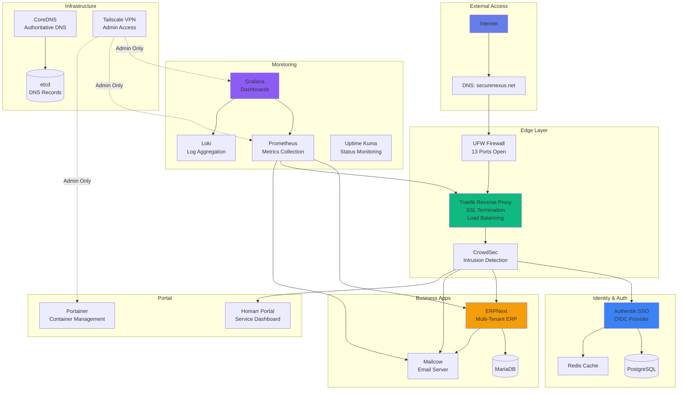
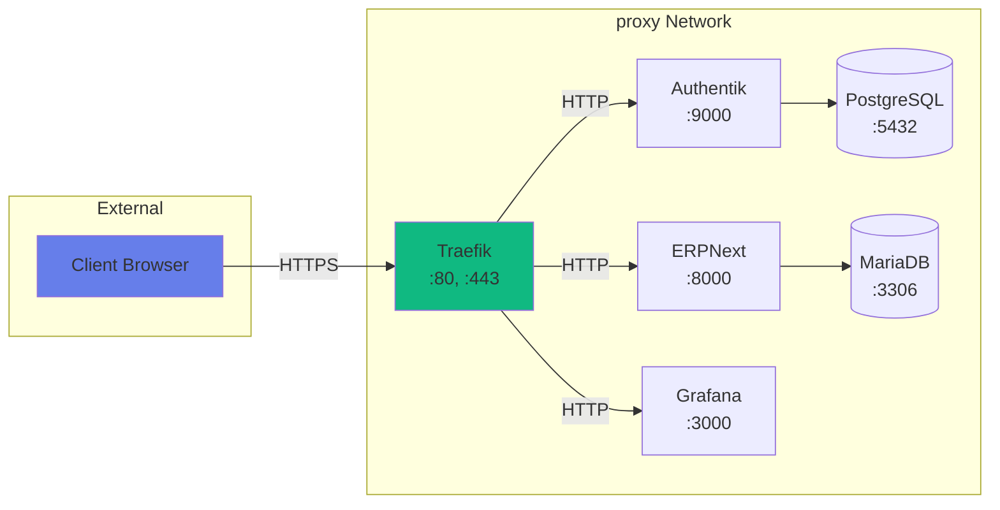
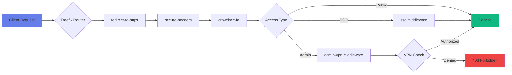
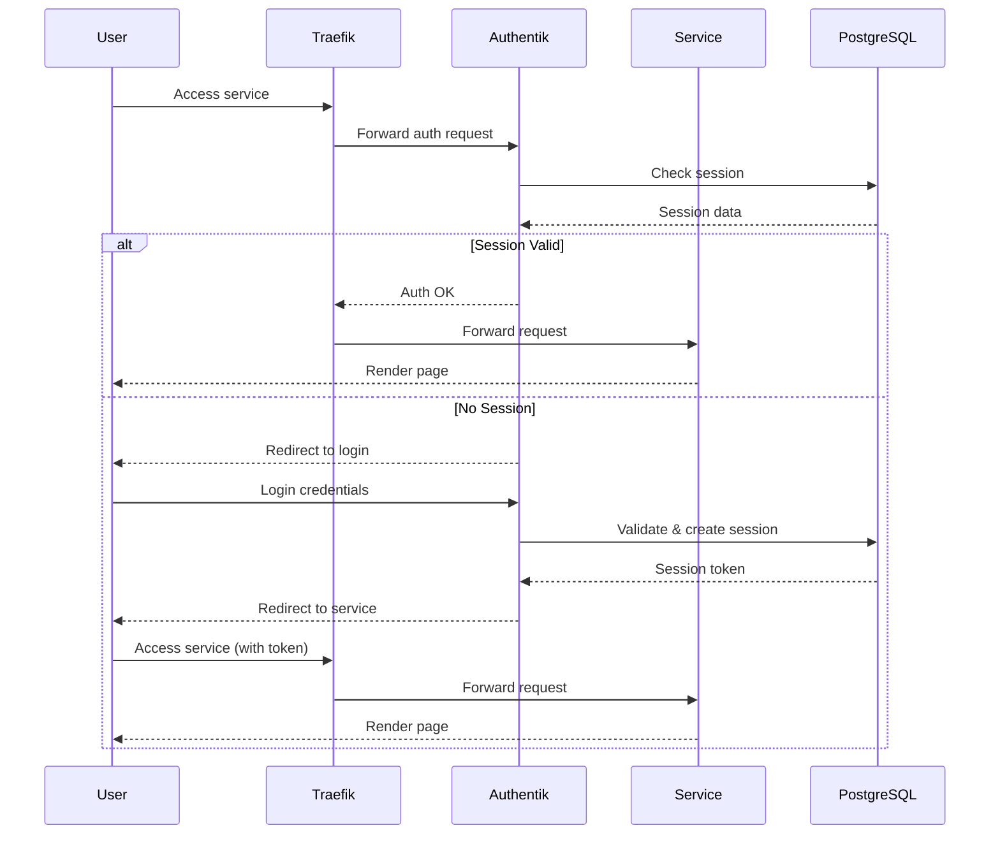
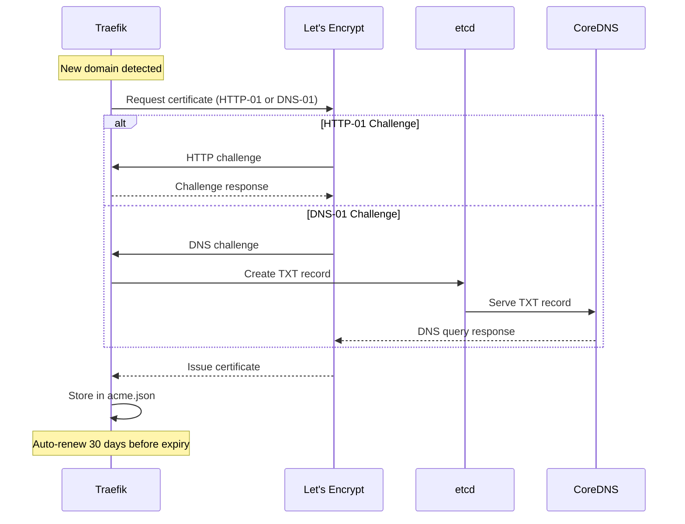
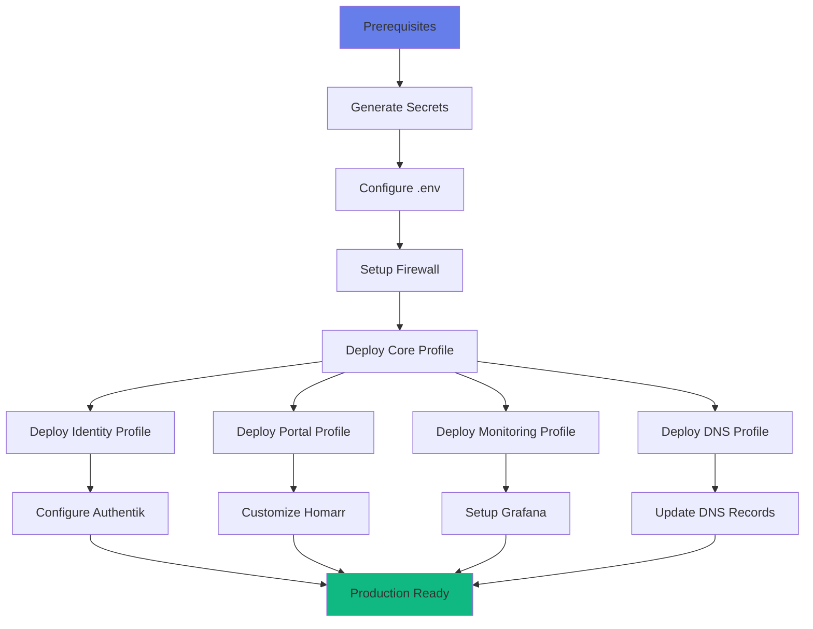

# System Architecture

Comprehensive architecture documentation for the SecureNexus Full Stack platform.

## High-Level Architecture



## Service Profiles

Services are organized into Docker Compose profiles for staged deployment:

### Core Profile

Essential infrastructure services that must start first:

- **docker-proxy**: Secure Docker API access for Traefik
- **traefik**: Reverse proxy and SSL termination
- **souin_redis**: Redis cache for HTTP caching
- **tailscale**: VPN service for admin access
- **crowdsec**: Intrusion detection service
- **crowdsec_bouncer**: Traefik bouncer integration

**Start Command**: `make up-core`

### Identity Profile

Authentication and SSO services:

- **authentik_db**: PostgreSQL database for Authentik
- **redis_cache**: Redis cache for session storage
- **authentik_server**: Main Authentik web server
- **authentik_worker**: Background job processor

**Dependencies**: Requires `core` profile
**Start Command**: `make up-identity`

### Portal Profile

User-facing portal and static sites:

- **landing**: Main landing page
- **homarr**: Service dashboard portal
- **wellknown**: `.well-known` directory server
- **brand-static**: Custom branding assets

**Dependencies**: Requires `core` profile
**Start Command**: `make up-portal`

### Monitoring Profile

Observability and monitoring stack:

- **prometheus**: Metrics collection and storage
- **blackbox**: Blackbox exporter for probing
- **loki**: Log aggregation
- **promtail**: Log shipping agent
- **grafana**: Visualization dashboards
- **cadvisor**: Container metrics
- **node-exporter**: System metrics
- **uptime-kuma**: Uptime monitoring

**Dependencies**: Requires `core` profile
**Start Command**: `make up-monitoring`

### DNS Profile

DNS infrastructure:

- **etcd**: Key-value store for DNS records
- **mysql-db**: MySQL database for CoreDNS plugin
- **coredns**: Authoritative DNS server
- **dns-updater**: Automatic DNS record updates
- **acme_webhook**: DNS-01 ACME challenge handler

**Dependencies**: Requires `core` profile
**Start Command**: `make up-dns`

## Network Architecture

All services communicate via the `proxy` Docker network:



### Internal DNS Resolution

Services use Docker's internal DNS (127.0.0.11) for container name resolution:

- `http://authentik_server:9000` - Authentik service
- `http://erpnext-backend:8000` - ERPNext service
- `authentik_db:5432` - PostgreSQL database
- `mariadb:3306` - MariaDB database

## Security Layers

### Middleware Chain



### Middleware Types

1. **redirect-to-https**: HTTP → HTTPS redirect
2. **secure-headers**: Security headers (HSTS, CSP, X-Frame-Options)
3. **crowdsec-fa**: CrowdSec intrusion prevention
4. **sso**: Authentik OIDC authentication
5. **admin-vpn**: Tailscale VPN-only access

### Service Access Control

| Service | Middleware Chain | Access Level |
|---------|-----------------|--------------|
| Homarr | secure-headers, crowdsec-fa | Public |
| ERPNext | secure-headers, crowdsec-fa | Public |
| Mailcow | secure-headers, crowdsec-fa | Public |
| Authentik | secure-headers, crowdsec-fa | Public |
| Grafana | secure-headers, admin-vpn | VPN Only |
| Prometheus | secure-headers, admin-vpn | VPN Only |
| Traefik Dashboard | secure-headers, admin-vpn | VPN Only |
| Portainer | secure-headers, admin-vpn | VPN Only |

## Data Flow

### User Authentication Flow



### SSL Certificate Flow



## Storage Architecture

### Persistent Volumes

```
/var/lib/docker/volumes/
├── authentik_db/          # PostgreSQL data
├── mariadb/               # ERPNext database
├── redis-cache/           # Session cache
├── etcd-data/             # DNS records
├── prometheus-data/       # Metrics (30-day retention)
├── grafana-data/          # Dashboards & configs
├── loki-data/             # Logs
├── uptime-kuma/           # Uptime data
└── traefik-acme/          # SSL certificates
```

### Configuration Files

```
/home/tristian/securenexus-fullstack/
├── config/
│   ├── traefik.yml                    # Static config
│   └── dynamic/
│       ├── traefik_dynamic.yml        # Middlewares, routes
│       └── souin.yml                  # HTTP cache config
├── dns/
│   ├── Corefile                       # CoreDNS config
│   └── zones/
│       └── securenexus.net.zone       # Zone file
├── monitoring/
│   ├── prometheus.yml                 # Scrape configs
│   ├── alert_rules.yml                # Alert rules
│   └── dashboards/                    # Grafana dashboards
└── secrets/                           # Credentials
```

## Deployment Architecture

### Staged Deployment Sequence



## High Availability Considerations

While the current deployment is single-server, the architecture supports future HA expansion:

### Database Replication

- **PostgreSQL**: Can be configured with streaming replication
- **MariaDB**: Supports Galera cluster for multi-master
- **etcd**: Built-in clustering support

### Load Balancing

- **Traefik**: Can run multiple instances behind external load balancer
- **Authentik**: Stateless workers can scale horizontally
- **ERPNext**: Supports multiple backend containers with sticky sessions

### Backup & Recovery

See [Disaster Recovery](../security/overview.md#disaster-recovery) for:
- Automated backup rotation (7 daily / 4 weekly / 12 monthly)
- Database dumps
- Volume snapshots
- Configuration backups

## Resource Requirements

### Minimum Specifications

- **CPU**: 4 cores
- **RAM**: 8 GB
- **Disk**: 100 GB SSD
- **Network**: 100 Mbps

### Recommended Specifications

- **CPU**: 8 cores
- **RAM**: 16 GB
- **Disk**: 250 GB NVMe SSD
- **Network**: 1 Gbps

### Per-Service Resource Limits

| Service | CPU Limit | Memory Limit | Memory Reservation |
|---------|-----------|--------------|-------------------|
| Prometheus | No limit | 2 GB | 1 GB |
| Grafana | No limit | 512 MB | 256 MB |
| MariaDB | No limit | 2 GB | 1 GB |
| PostgreSQL | No limit | 1 GB | 512 MB |
| ERPNext | No limit | 3 GB | 1.5 GB |

## Next Steps

- **[Infrastructure Details](../infrastructure/overview.md)**: Deep dive into DNS, VPN, firewall
- **[Security Architecture](../security/overview.md)**: Security hardening and policies
- **[Monitoring Setup](../monitoring/overview.md)**: Metrics, logs, and alerts
