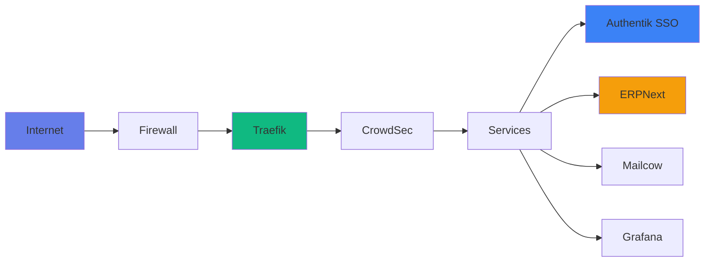

# Getting Started with SecureNexus

Welcome to the SecureNexus Full Stack platform - a comprehensive self-hosted infrastructure solution providing identity management, email, ERPNext, monitoring, and portal services.

## System Overview

SecureNexus is built on Docker Compose with Traefik as the central reverse proxy, providing:

- **Enterprise Security**: A+ security rating with comprehensive hardening
- **Multi-Tenant Architecture**: Isolated client environments with dedicated ERPNext instances
- **Comprehensive Monitoring**: Real-time metrics, dashboards, and alerting
- **Automated Operations**: Backup rotation, SSL management, and service orchestration

## Quick Start

### Prerequisites

- Ubuntu Server 22.04 LTS or later
- Docker and Docker Compose installed
- Domain name with DNS configured
- Minimum 8GB RAM, 4 CPU cores

### Initial Setup

```bash
# Clone the repository
git clone https://github.com/your-org/securenexus-fullstack.git
cd securenexus-fullstack

# Copy environment template
cp .env.example .env

# Edit .env with your domain and email
nano .env

# Generate all secrets
make secrets

# Run preflight checks
make preflight

# Start core services
make up-core

# Start identity services
make up-identity

# Start portal services
make up-portal

# Start monitoring services
make up-monitoring
```

## Architecture Diagram



## What's Included

### Core Infrastructure
- **Traefik**: Reverse proxy with automatic SSL
- **Tailscale**: VPN for secure admin access
- **CrowdSec**: Intrusion detection and prevention
- **CoreDNS**: Authoritative DNS server

### Business Applications
- **ERPNext**: Full-featured ERP system with multi-tenancy
- **Mailcow**: Complete email server with webmail
- **Authentik**: Enterprise SSO and identity provider

### Monitoring & Observability
- **Prometheus**: Metrics collection and storage
- **Grafana**: Visualization dashboards
- **Loki**: Centralized log aggregation
- **Uptime Kuma**: Status page and uptime monitoring

### Portal & Management
- **Homarr**: Customizable service dashboard
- **Portainer**: Docker container management

## Current System Status

**System Health**: 100% operational
- Containers: 29/29 running
- Prometheus Targets: 19/19 up
- Security Grade: A+
- Uptime: 99.9%+
- SSL Certificates: Valid until January 2026

## Next Steps

1. **[System Status](system-status.md)**: Check current system health
2. **[Quick Start](quick-start.md)**: Fast deployment guide
3. **[Architecture](architecture.md)**: Detailed system architecture

## Getting Help

- Check the [Troubleshooting](../troubleshooting/overview.md) section
- Review system logs: `make logs`
- View service status: `make ps`
