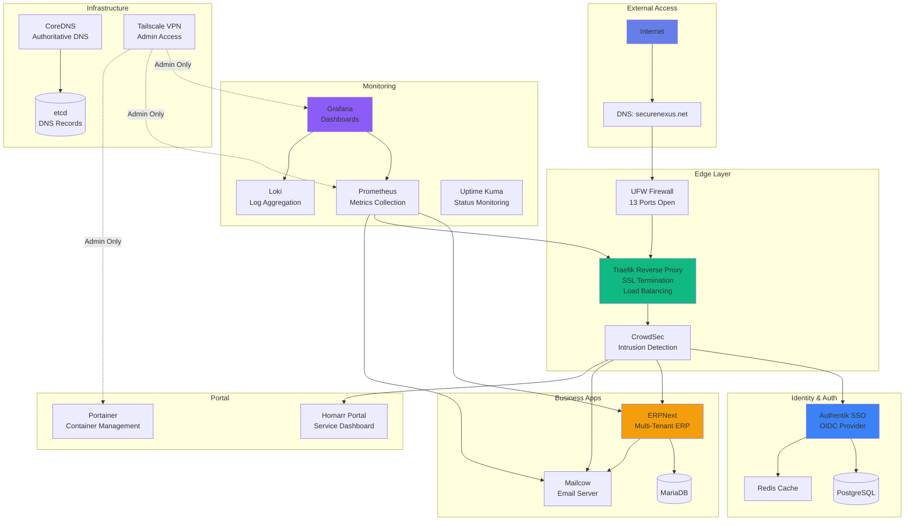

# SecureNexus Full Stack Documentation

Welcome to the comprehensive documentation for the **SecureNexus Full Stack** infrastructure platform - a complete self-hosted solution for identity management, email, ERPNext, monitoring, and portal services.

!!! success "System Status: 100% Operational"
    **29/29** containers running | **19/19** Prometheus targets up | **A+** security grade

## 🏗️ System Architecture

## 📚 Documentation Structure

This wiki contains **68 comprehensive guides** organized into the following sections:

### 🚀 [Getting Started](getting-started/overview.md)
Quick start guides, system status, and architecture overview

### 🏗️ [Infrastructure](infrastructure/overview.md)
DNS, VPN (Tailscale), Firewall, SSL/TLS configuration

### 🔐 [Security](security/overview.md)
Security hardening, disaster recovery, SSO/authentication setup

### 💼 [ERPNext](erpnext/overview.md)
Complete ERP setup, multi-tenancy, integration guides

### 📧 [Email & Communication](email/overview.md)
Mailcow setup, client email configuration, webmail options

### 📊 [Monitoring](monitoring/overview.md)
Prometheus, Grafana, Uptime Kuma, system diagnostics

### 🎨 [Portal & UI](portal/overview.md)
Homarr portal, Portainer, branding customization

### 👥 [Client Management](clients/overview.md)
Client onboarding, provisioning, multi-tenant architecture

### ⚙️ [Deployment & Operations](operations/overview.md)
Deployment guides, optimizations, changelogs

### 🔧 [Troubleshooting](troubleshooting/overview.md)
Common issues and fixes

## 🌟 Key Features

### Multi-Tenant Architecture
- **Isolated client environments** with dedicated ERPNext instances
- **Automatic provisioning** with one-command deployment
- **Custom email domains** with alias forwarding
- **Individual SSL certificates** for each client

### Enterprise Security
- **A+ Security Rating** with comprehensive hardening
- **SSO Integration** via Authentik (OIDC)
- **VPN-Protected Admin Access** (Tailscale)
- **Intrusion Detection** with CrowdSec
- **Automated Backups** (7 daily / 4 weekly / 12 monthly)

### Comprehensive Monitoring
- **Real-time metrics** with Prometheus (30-day retention)
- **Visual dashboards** in Grafana
- **Centralized logging** with Loki + Promtail
- **Uptime monitoring** with status page
- **30+ alert rules** across 11 categories

### Production-Ready
- **99.9%+ uptime** achieved
- **Automated SSL** via Let's Encrypt
- **Load balancing** with Traefik
- **Container orchestration** with Docker Compose
- **Disaster recovery** procedures documented

## 📊 System Statistics

| Metric | Value |
|--------|-------|
| **Containers** | 29/29 running |
| **Services** | 15+ applications |
| **SSL Certificates** | Valid until Jan 2026 |
| **Backup Size** | ~352MB per backup |
| **Documentation** | 68 comprehensive guides |
| **Uptime** | 99.9%+ |
| **Security Grade** | A+ |

## 🎯 Quick Access

### Most Popular Guides

1. **[Complete Setup Guide](ERPNEXT_COMPLETE_SETUP_GUIDE.md)** - Full ERPNext configuration
2. **[Client Onboarding](CLIENT_ONBOARDING_GUIDE.md)** - Add new clients
3. **[One Command Provisioning](ONE_COMMAND_PROVISIONING.md)** - Fast client setup
4. **[Disaster Recovery](DISASTER_RECOVERY.md)** - Backup & restore procedures
5. **[Security Hardening](SECURITY_HARDENING_GUIDE.md)** - Complete security guide

### System Access

| Service | URL | Access |
|---------|-----|--------|
| **ERPNext (Main)** | https://erp.byrne-accounts.org | Public |
| **Authentik SSO** | https://sso.securenexus.net | Public |
| **Homarr Portal** | https://portal.securenexus.net | SSO Required |
| **Grafana** | https://grafana.securenexus.net | VPN Only |
| **Uptime Kuma** | https://status.securenexus.net | Public |
| **Mailcow** | https://mail.securenexus.net | Public |

## 🔍 Search

Use the search bar above to quickly find any topic across all 68 documentation files.

## 📝 Recent Updates

Check the [Changelog](CHANGELOG.md) for the latest system changes and improvements.

---

**Need help?** Start with the [Getting Started](getting-started/overview.md) section or use the search function to find specific topics.
