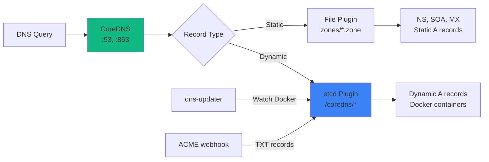
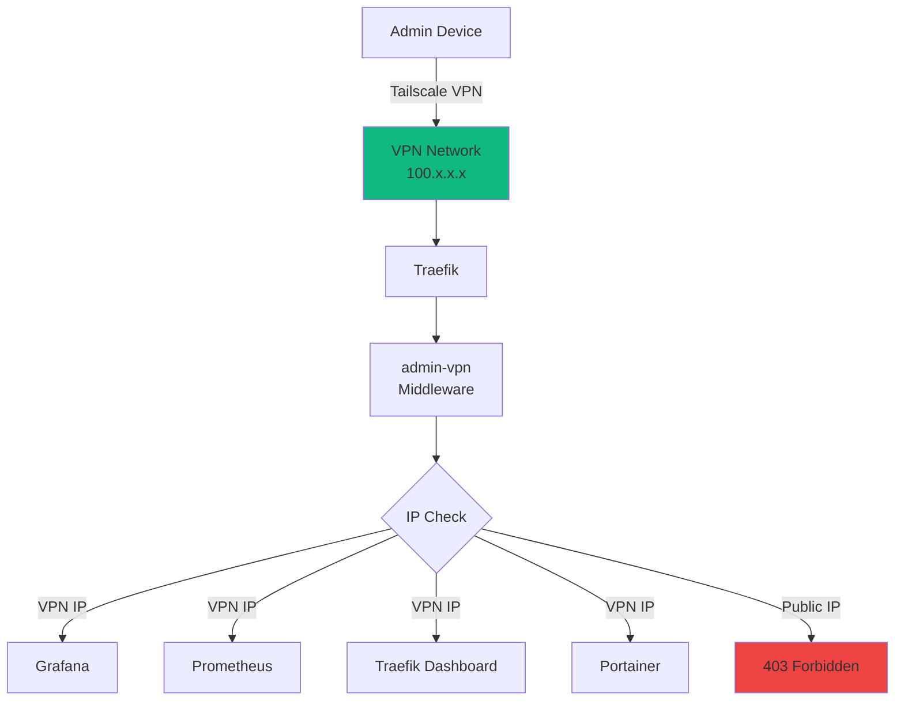
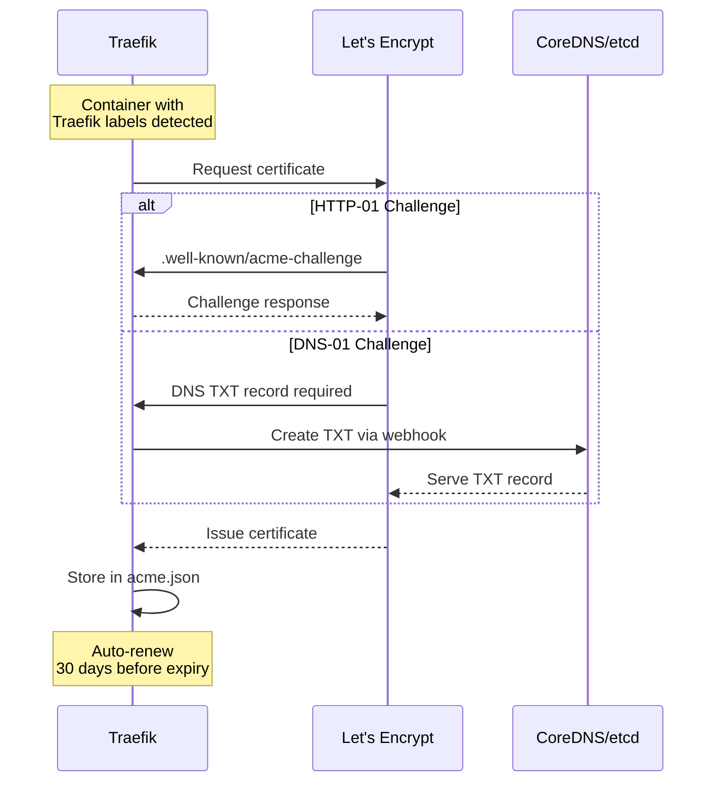

# Infrastructure Overview

Core infrastructure components providing DNS, VPN, SSL, and network services for the SecureNexus platform.

## Components

### DNS Infrastructure

**CoreDNS** serves as the authoritative DNS server with dual backend support:



**Key Features**:
- Authoritative DNS on ports 53 (UDP/TCP) and 853 (DNS-over-TLS)
- Automatic A record creation for Docker containers
- DNS-01 ACME challenge support
- etcd-backed dynamic records
- File-backed static records

**Setup Guides**:
- [DNS Setup Guide](../DNS_SETUP_GUIDE.md)
- [CoreDNS Migration](../COREDNS_MIGRATION.md)
- [Nameserver Setup](../NAMESERVER_SETUP.md)

### VPN Access (Tailscale)

**Tailscale** provides secure VPN access to admin-only services:



**Protected Services**:
- Grafana (https://grafana.securenexus.net)
- Prometheus (https://prometheus.securenexus.net)
- Traefik Dashboard (https://traefik.securenexus.net)
- Portainer (https://portainer.securenexus.net)

**Setup Guides**:
- [Tailscale Setup](../VPN_SETUP.md)
- [Tailscale Access Guide](../TAILSCALE_ACCESS_GUIDE.md)
- [Tailscale Hosts](../TAILSCALE_HOSTS_SETUP.md)
- [VPN Health Check](../VPN_HEALTH_CHECK_ISSUE.md)

### Firewall Configuration

**UFW (Uncomplicated Firewall)** with deny-by-default policy:

**Open Ports**:
```
22    - SSH (rate-limited)
25    - SMTP (Mailcow)
53    - DNS (CoreDNS)
80    - HTTP (→ HTTPS redirect)
143   - IMAP (Mailcow)
443   - HTTPS (Traefik)
465   - SMTPS (Mailcow)
587   - Submission (Mailcow)
853   - DNS-over-TLS (CoreDNS)
993   - IMAPS (Mailcow)
995   - POP3S (Mailcow)
41641/udp - Tailscale
```

**Security Features**:
- Rate limiting on SSH (6 connections/30s)
- Deny-by-default policy
- IPv4 and IPv6 support
- Perfect alignment with listening services

**Setup Guides**:
- [Firewall Configuration](../FIREWALL.md)
- [Firewall Analysis](../FIREWALL_ANALYSIS.md)
- [Firewall Status](../FIREWALL_STATUS.md)

### SSL/TLS Certificates

**Let's Encrypt** certificates managed by Traefik with automatic renewal:



**Features**:
- Automatic certificate issuance
- Wildcard certificate support (DNS-01)
- 30-day auto-renewal
- Central storage in `acme/acme.json`
- Sync to Mailcow via script

**Setup Guides**:
- [SSL Final Solution](../SSL_FINAL_SOLUTION.md)
- [SSL Status](../SSL_STATUS.md)
- [Certbot Guide](../CERTBOT_GUIDE.md)

## Infrastructure Services

### Traefik (Reverse Proxy)

**Configuration Files**:
- `config/traefik.yml` - Static configuration (requires restart)
- `config/dynamic/traefik_dynamic.yml` - Dynamic config (auto-reloads)
- `config/dynamic/souin.yml` - HTTP cache configuration

**Features**:
- Automatic SSL via Let's Encrypt
- HTTP → HTTPS redirect
- Middleware chains (security, auth, caching)
- Docker service discovery
- Metrics export (Prometheus)

**Key Endpoints**:
- Dashboard: https://traefik.securenexus.net (VPN only)
- API: http://localhost:8080/api/rawdata
- Metrics: http://localhost:8080/metrics

### Docker Socket Proxy

Secure Docker API access for Traefik:

**Security**:
- Read-only access
- Only containers endpoint exposed
- No write operations allowed
- Isolated network

**Configuration**:
```yaml
environment:
  CONTAINERS: 1  # Enable container endpoint
  NETWORKS: 0    # Disable networks
  SERVICES: 0    # Disable services
  TASKS: 0       # Disable tasks
  POST: 0        # Disable POST/PUT/DELETE
```

### Souin HTTP Cache

**Features**:
- 60-second TTL with 30s stale serving
- Excludes real-time endpoints (ACME, OIDC, metrics)
- Regex-based exclusion patterns
- Redis backend for distributed caching

**Configuration**: `config/dynamic/souin.yml`

**Excluded Patterns**:
- `/api/*` - APIs
- `/metrics` - Prometheus metrics
- `/.well-known/acme-challenge/*` - ACME
- `/application/o/*` - OIDC/OAuth

## DNS Record Management

### Static Records (File Backend)

Defined in `dns/zones/securenexus.net.zone`:

```zone
$TTL 3600
@   IN  SOA ns1.securenexus.net. admin.securenexus.net. (
        2025100701  ; Serial
        3600        ; Refresh
        1800        ; Retry
        604800      ; Expire
        86400 )     ; Minimum TTL

; Nameservers
@   IN  NS  ns1.securenexus.net.
@   IN  NS  ns2.securenexus.net.

; Static A records
ns1  IN  A   <server-ip>
ns2  IN  A   <server-ip>

; MX records
@    IN  MX  10 mail.securenexus.net.
```

### Dynamic Records (etcd Backend)

Automatically created by `dns-updater` service:

**Process**:
1. Watches Docker events
2. Detects container start/stop
3. Creates/deletes A records in etcd
4. CoreDNS serves records immediately

**etcd Path**: `/coredns/net/securenexus/<subdomain>`

**Example**:
```bash
# View all DNS records in etcd
docker compose exec etcd etcdctl get --prefix /coredns/

# Add manual record
docker compose exec etcd etcdctl put /coredns/net/securenexus/test '{"host":"1.2.3.4","ttl":300}'
```

## Network Architecture

### Docker Networks

**Primary Network**: `proxy`
- All services communicate via this network
- Internal DNS resolution (127.0.0.11)
- Traefik-managed routing

**Service Discovery**:
```bash
# Services can reach each other by name
curl http://authentik_server:9000
curl http://erpnext-backend:8000
curl http://grafana:3000
```

### IP Address Ranges

- **Docker Network**: 172.18.0.0/16
- **Tailscale VPN**: 100.64.0.0/10
- **Public Services**: 0.0.0.0/0
- **VPN-Only Services**: 100.64.0.0/10

## Monitoring

All infrastructure services export metrics to Prometheus:

| Service | Metrics Port | Job Name |
|---------|-------------|----------|
| Traefik | 8080 | traefik |
| CoreDNS | 9153 | coredns |
| Node Exporter | 9100 | node |
| cAdvisor | 8080 | cadvisor |
| Blackbox | 9115 | blackbox |

**Dashboards**:
- Traefik Overview (Grafana)
- DNS Performance (Grafana)
- System Metrics (Grafana)

## Maintenance

### DNS Sync

```bash
# Manually trigger DNS sync
./scripts/dns-sync.sh

# View current DNS records
docker compose exec etcd etcdctl get --prefix /coredns/ | jq
```

### Certificate Renewal

```bash
# Check certificate expiry
echo | openssl s_client -connect securenexus.net:443 2>/dev/null | openssl x509 -noout -dates

# Force certificate renewal (rarely needed)
docker compose restart traefik
```

### Firewall Updates

```bash
# Check firewall status
sudo ufw status numbered

# Add new rule
sudo ufw allow <port>/<protocol>

# Delete rule
sudo ufw delete <rule-number>

# Reload firewall
sudo ufw reload
```

### VPN Management

```bash
# Check Tailscale status
docker compose exec tailscale tailscale status

# Check connected devices
docker compose exec tailscale tailscale status --json | jq '.Peer'

# Restart Tailscale
docker compose restart tailscale
```

## Troubleshooting

### DNS Not Resolving

```bash
# Test DNS locally
dig @localhost securenexus.net

# Check CoreDNS logs
docker compose logs coredns | tail -50

# Verify etcd records
docker compose exec etcd etcdctl get --prefix /coredns/
```

### SSL Certificate Issues

```bash
# Check Traefik ACME logs
docker compose logs traefik | grep -i acme

# View stored certificates
docker compose exec traefik cat /acme.json | jq '.le.Certificates'

# Verify DNS propagation (for DNS-01)
dig TXT _acme-challenge.securenexus.net
```

### VPN Connection Failed

```bash
# Check Tailscale logs
docker compose logs tailscale

# Verify container networking
docker compose exec tailscale ip addr

# Test VPN connectivity
docker compose exec tailscale tailscale ping <peer-name>
```

## Next Steps

- **[Security Overview](../security/overview.md)**: Harden infrastructure
- **[Monitoring Setup](../monitoring/overview.md)**: Track infrastructure health
- **[Troubleshooting](../troubleshooting/overview.md)**: Fix common issues
