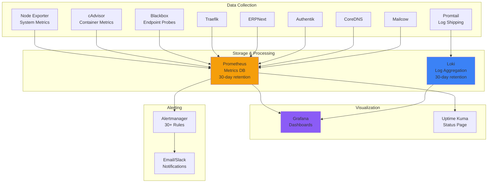

# Monitoring & Observability Overview

Comprehensive monitoring stack with Prometheus, Grafana, Loki, and Uptime Kuma.

## Monitoring Architecture



## Components

### Prometheus

**Metrics collection and time-series database**

**Configuration**:
- Retention: 30 days (720 hours)
- Max size: 50GB
- Memory: 2GB limit, 1GB reservation
- Scrape interval: 15s

**Exporters**:

| Exporter | Port | Metrics |
|----------|------|---------|
| Node Exporter | 9100 | System: CPU, memory, disk, network |
| cAdvisor | 8080 | Containers: resource usage, limits |
| Blackbox | 9115 | Probes: HTTP, DNS, TCP checks |
| Traefik | 8080 | Proxy: requests, errors, latency |
| CoreDNS | 9153 | DNS: queries, cache, latency |
| Redis | 6379 | Cache: keys, memory, hits/misses |

**Access**: `https://prometheus.securenexus.net` (VPN required)

**Configuration**: `monitoring/prometheus.yml`

### Grafana

**Visualization and dashboards**

**Features**:
- Pre-configured dashboards
- Custom dashboard builder
- Alert visualization
- Query builder
- User management

**Access**: `https://grafana.securenexus.net` (VPN required)

**Credentials**:
- Username: `admin`
- Password: (see `secrets/grafana_admin_password`)

**Datasources**:
- Prometheus (default)
- Loki (logs)

**Pre-configured Dashboards**:
1. **Traefik Overview** (`monitoring/dashboards/traefik-overview.json`)
   - Request rate
   - Response times
   - Error rates
   - Backend health
   - SSL certificate status

2. **Uptime & Blackbox** (`monitoring/dashboards/uptime-blackbox.json`)
   - Service availability
   - Probe success rates
   - Response times
   - DNS resolution
   - SSL expiry

3. **System Overview** (Node Exporter)
   - CPU usage
   - Memory usage
   - Disk I/O
   - Network traffic

4. **Container Metrics** (cAdvisor)
   - Container resource usage
   - Container health
   - Resource limits
   - Restart counts

**Documentation**: Grafana provisioning in `monitoring/grafana/provisioning/`

### Loki

**Log aggregation and querying**

**Features**:
- Centralized log storage
- Label-based indexing
- LogQL query language
- Integration with Grafana

**Retention**: 30 days

**Storage**: Docker volume `loki-data`

**Log Sources**:
- All Docker containers (via Promtail)
- System logs (journald)
- Application logs

**Configuration**: `monitoring/loki.yml`

### Promtail

**Log shipping agent**

**Configuration**: `monitoring/promtail.yml`

**Log Collection**:
```yaml
scrape_configs:
  - job_name: containers
    docker_sd_configs:
      - host: unix:///var/run/docker.sock
    relabel_configs:
      - source_labels: ['__meta_docker_container_name']
        target_label: 'container_name'
      - source_labels: ['__meta_docker_container_log_stream']
        target_label: 'stream'
```

**Labels Applied**:
- `container_name`: Docker container name
- `stream`: stdout or stderr
- `job`: Scrape job name

### Uptime Kuma

**Status page and uptime monitoring**

**Features**:
- HTTP/HTTPS monitoring
- TCP port checks
- Ping monitoring
- DNS resolution checks
- Docker container monitoring
- Status page (public or private)
- Multi-notification channels

**Access**: `https://status.securenexus.net` (public)

**Monitored Services**:
- All public endpoints
- Critical internal services
- Database health
- SSL certificate expiry

**Notifications**:
- Email
- Slack
- Discord
- Telegram
- Webhook

**Setup**: [Uptime Kuma Setup Guide](../UPTIME_KUMA_SETUP.md)

## Metrics Collection

### Service Discovery

Prometheus automatically discovers targets via:

1. **Docker labels** on services:
```yaml
labels:
  prometheus.scrape: "true"
  prometheus.port: "8080"
  prometheus.path: "/metrics"
```

2. **Static configuration** in prometheus.yml:
```yaml
scrape_configs:
  - job_name: 'traefik'
    static_configs:
      - targets: ['traefik:8080']
```

### Scrape Intervals

- **Default**: 15s
- **System metrics**: 15s
- **Container metrics**: 15s
- **Application metrics**: 30s
- **Probes**: 60s

### Key Metrics

**System Metrics** (Node Exporter):
```promql
# CPU usage percentage
100 - (avg(irate(node_cpu_seconds_total{mode="idle"}[5m])) * 100)

# Memory usage percentage
(1 - (node_memory_MemAvailable_bytes / node_memory_MemTotal_bytes)) * 100

# Disk usage percentage
(node_filesystem_avail_bytes / node_filesystem_size_bytes) * 100

# Network throughput
rate(node_network_receive_bytes_total[5m])
```

**Container Metrics** (cAdvisor):
```promql
# Container CPU usage
rate(container_cpu_usage_seconds_total[5m])

# Container memory usage
container_memory_usage_bytes

# Container network I/O
rate(container_network_receive_bytes_total[5m])
```

**Application Metrics** (Traefik):
```promql
# Request rate
rate(traefik_entrypoint_requests_total[5m])

# Request duration
histogram_quantile(0.95, rate(traefik_entrypoint_request_duration_seconds_bucket[5m]))

# Error rate
rate(traefik_entrypoint_requests_total{code=~"5.."}[5m])
```

## Alerting

### Alert Rules

**Configuration**: `monitoring/alert_rules.yml`

**30+ Rules across 11 categories**:

#### 1. Service Availability (7 rules)

```yaml
- alert: ServiceDown
  expr: up == 0
  for: 5m
  annotations:
    summary: "Service {{ $labels.job }} is down"

- alert: HighRestartRate
  expr: rate(container_last_seen[5m]) > 0
  for: 10m
  annotations:
    summary: "Container {{ $labels.name }} restarting frequently"
```

#### 2. Resource Usage (6 rules)

```yaml
- alert: HighCPUUsage
  expr: 100 - (avg(irate(node_cpu_seconds_total{mode="idle"}[5m])) * 100) > 80
  for: 10m

- alert: HighMemoryUsage
  expr: (1 - (node_memory_MemAvailable_bytes / node_memory_MemTotal_bytes)) * 100 > 90
  for: 5m

- alert: DiskSpaceLow
  expr: (node_filesystem_avail_bytes / node_filesystem_size_bytes) * 100 < 10
  for: 5m
```

#### 3. Security Events (3 rules)

```yaml
- alert: CrowdSecAnomalies
  expr: rate(crowdsec_bans_total[5m]) > 10

- alert: SSHBruteForce
  expr: rate(node_network_receive_bytes_total{device="eth0"}[5m]) > 1000000

- alert: FailedAuthSpike
  expr: rate(authentik_failed_logins_total[5m]) > 10
```

#### 4. SSL Certificates (1 rule)

```yaml
- alert: SSLCertificateExpiring
  expr: (probe_ssl_earliest_cert_expiry - time()) / 86400 < 7
  for: 1h
  annotations:
    summary: "SSL certificate for {{ $labels.instance }} expires in < 7 days"
```

#### 5. Application Errors (1 rule)

```yaml
- alert: HighHTTP5xxRate
  expr: rate(traefik_entrypoint_requests_total{code=~"5.."}[5m]) > 0.05
  for: 5m
  annotations:
    summary: "High rate of 5xx errors on {{ $labels.entrypoint }}"
```

### Alert Severity Levels

- **Critical**: Immediate action required (service down, security breach)
- **Warning**: Attention needed (high resource usage, approaching limits)
- **Info**: Informational (maintenance mode, planned changes)

### Notification Channels

Configure in Grafana or Alertmanager:

**Email**:
```yaml
receivers:
  - name: 'email'
    email_configs:
      - to: 'admin@securenexus.net'
        from: 'alerts@securenexus.net'
```

**Slack**:
```yaml
receivers:
  - name: 'slack'
    slack_configs:
      - api_url: 'https://hooks.slack.com/services/...'
        channel: '#alerts'
```

## Dashboards

### Accessing Dashboards

**Grafana**: `https://grafana.securenexus.net` (VPN required)

1. Login with admin credentials
2. Navigate to Dashboards
3. Select pre-configured dashboard

### Creating Custom Dashboards

**Via UI**:
1. Click "+" → Dashboard
2. Add Panel
3. Select datasource (Prometheus or Loki)
4. Write query
5. Configure visualization
6. Save dashboard

**Via JSON**:
1. Export existing dashboard as JSON
2. Modify JSON
3. Import via UI or place in `monitoring/dashboards/`

### Dashboard Examples

**System Overview**:
- CPU gauge
- Memory usage graph
- Disk I/O graph
- Network traffic graph
- Top processes table

**Traefik Overview**:
- Request rate (requests/sec)
- Response time (p50, p95, p99)
- Error rate by status code
- Backend response times
- Active connections

**Uptime & Availability**:
- Service uptime percentage
- Probe success rates
- Response times by service
- SSL certificate expiry countdown
- Recent downtime events

## Log Analysis

### Accessing Logs

**Via Grafana**:
1. Go to Explore
2. Select Loki datasource
3. Write LogQL query
4. View results

**Via CLI** (Loki):
```bash
# Install logcli
wget https://github.com/grafana/loki/releases/download/v2.9.0/logcli-linux-amd64.zip
unzip logcli-linux-amd64.zip
sudo mv logcli-linux-amd64 /usr/local/bin/logcli

# Query logs
logcli query '{container_name="erpnext-backend"}' --addr=http://localhost:3100
```

### LogQL Queries

**Basic queries**:
```logql
# All logs from a container
{container_name="erpnext-backend"}

# Filter by keyword
{container_name="traefik"} |= "error"

# Exclude pattern
{job="containers"} != "debug"

# Regex filter
{container_name="authentik_server"} |~ "HTTP/1.1\" [45]0[0-9]"
```

**Aggregations**:
```logql
# Count errors per minute
rate({container_name="erpnext-backend"} |= "ERROR" [1m])

# Top error messages
topk(10, sum by (container_name) (rate({job="containers"} |= "error" [5m])))
```

### Log Retention

- **Loki retention**: 30 days
- **Docker logs**: 10MB per file, 3 files max
- **System logs**: 14 days (logrotate)

## Performance Monitoring

### Key Performance Indicators (KPIs)

**System**:
- CPU utilization < 80%
- Memory utilization < 90%
- Disk usage < 85%
- Disk I/O latency < 10ms

**Application**:
- HTTP request rate
- HTTP response time (p95 < 500ms)
- Error rate < 1%
- SSL certificate validity > 7 days

**Database**:
- Query response time
- Connection pool usage
- Slow query count
- Replication lag (if applicable)

### Capacity Planning

**Current Usage** (as of October 2025):
```
CPU:        4 cores @ ~30% avg
Memory:     16GB @ 60% usage
Disk:       500GB @ 37% usage
Network:    ~2.5GB/day inbound, ~3.2GB/day outbound
```

**Growth Projections**:
- Monitor trends over 30 days
- Plan for 2x capacity headroom
- Alert when approaching 80% capacity

## System Diagnostics

### Health Checks

**Automated checks**:
- Container health (Docker health checks)
- HTTP endpoint probes (Blackbox)
- DNS resolution (Blackbox)
- SSL certificate validity (Blackbox)
- Database connectivity (application health)

**Manual checks**:
```bash
# System health
docker compose ps
make ps

# View metrics
curl http://localhost:9090/metrics

# Check Prometheus targets
curl http://localhost:9090/api/v1/targets | jq '.data.activeTargets[] | {job: .labels.job, health: .health}'
```

### Diagnostic Reports

Pre-generated diagnostic reports:
- [System Diagnostic Report](../SYSTEM_DIAGNOSTIC_REPORT.md)
- [System Diagnostic Report 2025-10-07](../SYSTEM_DIAGNOSTIC_REPORT_2025-10-07.md)
- [System Status Final](../SYSTEM_STATUS_FINAL.md)

## Troubleshooting

### Grafana 403 Error

**Issue**: Grafana returns 403 Forbidden

**Cause**: VPN middleware blocking non-Tailscale IPs

**Solution**: Connect via Tailscale VPN

**Documentation**: [Grafana 403 Explanation](../GRAFANA_403_EXPLANATION.md)

### Prometheus High Memory

**Issue**: Prometheus using excessive memory

**Solution**:
- Increased memory limit to 2GB (completed)
- Adjust retention time if needed
- Reduce scrape targets
- Increase scrape intervals

### Missing Metrics

**Issue**: Metrics not appearing in Grafana

**Check**:
1. Service exposing metrics: `curl http://<service>:<port>/metrics`
2. Prometheus scraping: Check Prometheus targets page
3. Scrape errors: Check Prometheus logs
4. Firewall: Ensure metrics port accessible

### Log Shipping Failures

**Issue**: Logs not appearing in Loki

**Check**:
1. Promtail running: `docker compose ps promtail`
2. Promtail config: `monitoring/promtail.yml`
3. Promtail logs: `docker compose logs promtail`
4. Loki accessible: `curl http://loki:3100/ready`

## Best Practices

### Dashboard Design

- **Use templates** for consistent styling
- **Group related metrics** in rows
- **Add descriptions** to panels
- **Set appropriate time ranges**
- **Use thresholds** for visual alerts

### Alert Configuration

- **Set appropriate thresholds** (not too sensitive)
- **Use "for" duration** to avoid flapping
- **Write clear annotations** with context
- **Test alerts** before enabling
- **Route by severity** to appropriate channels

### Resource Management

- **Monitor disk usage** for Prometheus/Loki
- **Adjust retention** based on disk space
- **Archive old data** if needed
- **Optimize queries** for performance
- **Use recording rules** for expensive queries

## Next Steps

- **[Uptime Kuma Setup](../UPTIME_KUMA_SETUP.md)**: Configure status page
- **[System Status](../getting-started/system-status.md)**: View current health
- **[Security Overview](../security/overview.md)**: Security monitoring
- **[Troubleshooting](../troubleshooting/overview.md)**: Fix common issues
