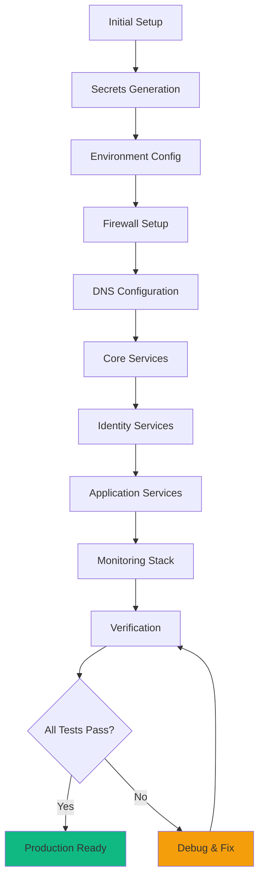

# Deployment & Operations Overview

Deployment procedures, optimizations, and operational maintenance.

## Deployment Strategy



## Deployment Phases

### Phase 1: Prerequisites (15 min)

**Server preparation**:

```bash
# Update system
sudo apt update && sudo apt upgrade -y

# Install Docker
curl -fsSL https://get.docker.com | sh

# Install Docker Compose
sudo apt install docker-compose-plugin -y

# Add user to docker group
sudo usermod -aG docker $USER

# Reboot
sudo reboot
```

**Verify**:
```bash
docker --version
docker compose version
```

### Phase 2: Configuration (10 min)

**Clone repository**:
```bash
git clone https://github.com/your-org/securenexus-fullstack.git
cd securenexus-fullstack
```

**Environment setup**:
```bash
# Copy template
cp .env.example .env

# Edit configuration
nano .env

# Required variables:
# DOMAIN=your-domain.com
# EMAIL=admin@your-domain.com
```

**Generate secrets**:
```bash
make secrets

# Verify secrets created
ls -la secrets/
# Should show 30+ secret files
```

### Phase 3: DNS Setup (10 min)

**Add DNS records**:

```dns
; Main domain
@   IN  A    <server-ip>
*   IN  A    <server-ip>

; Mail records
@   IN  MX   10 mail.your-domain.com.
@   IN  TXT  "v=spf1 mx ~all"
_dmarc  IN  TXT  "v=DMARC1; p=quarantine"

; Nameserver (if authoritative)
@   IN  NS   ns1.your-domain.com.
@   IN  NS   ns2.your-domain.com.
ns1 IN  A    <server-ip>
ns2 IN  A    <server-ip>
```

**Verify propagation**:
```bash
dig your-domain.com
dig MX your-domain.com
dig TXT your-domain.com
```

### Phase 4: Firewall (5 min)

**Configure UFW**:
```bash
sudo ./scripts/setup-ufw-firewall.sh

# Verify
sudo ufw status numbered
```

**Expected rules**:
```
22      - SSH (rate-limited)
25      - SMTP
53      - DNS (UDP/TCP)
80      - HTTP
143     - IMAP
443     - HTTPS
465     - SMTPS
587     - Submission
853     - DNS-over-TLS
993     - IMAPS
995     - POP3S
41641/udp - Tailscale
```

### Phase 5: Core Services (5 min)

**Deploy core infrastructure**:

```bash
# Start core services
make up-core

# Expected services:
# - docker-proxy
# - traefik
# - souin_redis
# - tailscale
# - crowdsec
# - crowdsec_bouncer

# Verify
docker compose ps
```

**Wait**: 30-60 seconds for services to initialize

### Phase 6: Identity Services (5 min)

**Deploy authentication**:

```bash
# Start identity services
make up-identity

# Expected services:
# - authentik_db
# - redis_cache
# - authentik_server
# - authentik_worker

# Verify
docker compose ps
docker compose logs authentik_server | grep "Running on"
```

**Configure Authentik**:
1. Visit `https://sso.your-domain.com/if/flow/initial-setup/`
2. Create admin account
3. Set strong password
4. Save credentials securely

### Phase 7: Portal Services (3 min)

```bash
make up-portal

# Services: landing, homarr, wellknown, brand-static
```

### Phase 8: Monitoring (5 min)

```bash
make up-monitoring

# Services: prometheus, grafana, loki, promtail,
#           uptime-kuma, cadvisor, node-exporter, blackbox
```

**Configure monitoring**:
1. Grafana: Visit `https://grafana.your-domain.com` (VPN required)
2. Login: `admin` / (see `secrets/grafana_admin_password`)
3. Explore pre-configured dashboards

### Phase 9: Verification (10 min)

**Run smoke tests**:
```bash
./scripts/smoke-postdeploy.sh
```

**Manual verification**:

| Service | URL | Test |
|---------|-----|------|
| Traefik | https://traefik.your-domain.com | Dashboard loads (VPN) |
| Authentik | https://sso.your-domain.com | Login page loads |
| Homarr | https://portal.your-domain.com | Dashboard loads |
| Grafana | https://grafana.your-domain.com | Dashboards load (VPN) |
| Uptime Kuma | https://status.your-domain.com | Status page loads |

**Check SSL**:
```bash
echo | openssl s_client -connect sso.your-domain.com:443 | grep "Verify return code"
# Should show: Verify return code: 0 (ok)
```

**Total Deployment Time**: 60-80 minutes

## Deployment Documentation

### Comprehensive Guides

- **[Quick Start](../getting-started/quick-start.md)**: Fast deployment guide
- **[Deployment Summary](../DEPLOYMENT_SUMMARY.md)**: Deployment overview and checklist

## Optimizations

### October 2025 Performance Improvements

**1. Prometheus Memory Increase**
- **Before**: 1GB limit
- **After**: 2GB limit, 1GB reservation
- **Benefit**: Prevents OOM under heavy load
- **Impact**: Stable metrics collection

**2. Grafana VPN Protection**
- **Added**: `admin-vpn@file` middleware
- **Benefit**: Requires Tailscale VPN connection
- **Impact**: Enhanced security for metrics visualization

**3. Uptime Kuma Docker Access**
- **Granted**: Read-only Docker socket access
- **Benefit**: Monitor container health
- **Impact**: Better status page accuracy

**4. CrowdSec LAPI Mode**
- **Mode**: LAPI-only (no log parsing)
- **Benefit**: Reduced resource usage
- **Impact**: Maintained full bouncer protection

**5. ACME Optimization**
- **Removed**: Unnecessary `.ts.net` certificate requests
- **Benefit**: Reduced Let's Encrypt rate limiting exposure
- **Impact**: Cleaner logs, faster renewals

**6. Firewall Optimization**
- **Added**: POP3S port (995)
- **Removed**: Duplicate SSH rule
- **Benefit**: Perfect alignment with services
- **Impact**: Cleaner firewall rules

**Documentation**: [Optimization Changes 2025-10-07](../OPTIMIZATION_CHANGES_2025-10-07.md)

### Improvements Completed

**Infrastructure**:
- ✅ Headscale → Tailscale migration
- ✅ PowerDNS → CoreDNS migration
- ✅ Stalwart → Mailcow migration

**Security**:
- ✅ All 7 hardening measures implemented
- ✅ A+ security grade achieved
- ✅ Comprehensive alerting (30+ rules)

**Documentation**:
- ✅ 68 comprehensive guides created
- ✅ Disaster recovery procedures documented
- ✅ Troubleshooting guides added

**Documentation**: [Improvements Completed](../IMPROVEMENTS_COMPLETED.md)

## Change Management

### Change Log

**Latest changes** tracked in:
- **[CHANGELOG.md](../CHANGELOG.md)**: Overall change log
- **[CHANGELOG_2025-10-18.md](../CHANGELOG_2025-10-18.md)**: Recent ERPNext changes

### Version Control

**Git workflow**:

```bash
# Before making changes
git status
git pull origin main

# Make changes
# Edit files...

# Commit changes
git add .
git commit -m "Description of changes"

# Push to remote
git push origin main
```

**Recent commits**:
```
007d110 Add ERPNext multi-site and multi-tier admin infrastructure
62f706b Add Portainer container management with Homarr integration
d4082fd Add comprehensive change log for ERPNext implementation
543dacc Add Byrne Accounting website and utility scripts
c225c03 Add Byrne Accounting deployment checklist
```

## Operational Procedures

### Daily Operations

**Health checks** (automated via monitoring):
- Container status
- Service availability
- Resource usage
- SSL certificate validity
- Backup completion

**Manual checks** (optional):
```bash
# View all containers
docker compose ps

# Check logs for errors
docker compose logs --tail=100 | grep -i error

# Check disk space
df -h

# Check backup status
ls -lh /backup/securenexus/daily/
```

### Weekly Maintenance

**Tasks**:
- [ ] Review monitoring alerts
- [ ] Check backup integrity
- [ ] Review security logs
- [ ] Update documentation if needed
- [ ] Plan updates (if any)

```bash
# Review alerts
# (via Grafana or Prometheus UI)

# Test latest backup
./scripts/test-backup-restore.sh

# Check CrowdSec banned IPs
docker compose exec crowdsec cscli decisions list

# Review firewall logs
sudo journalctl -u ufw | tail -100
```

### Monthly Maintenance

**Tasks**:
- [ ] Rotate secrets (per schedule)
- [ ] Review user accounts
- [ ] Check for software updates
- [ ] Test disaster recovery
- [ ] Review capacity planning

```bash
# Update Docker images (if needed)
docker compose pull
docker compose up -d

# Clean unused resources
docker system prune -a --volumes --filter "until=720h"

# Check for OS updates
sudo apt update && sudo apt list --upgradable
```

### Quarterly Maintenance

**Tasks**:
- [ ] Rotate database passwords
- [ ] Security audit
- [ ] Performance review
- [ ] Update documentation
- [ ] Stakeholder review

## Update Procedures

### Updating Services

**Minor updates** (patch releases):

```bash
# Pull latest images
docker compose pull

# Recreate containers with new images
docker compose up -d

# Verify
docker compose ps
```

**Major updates** (breaking changes):

1. **Backup first**:
```bash
sudo ./scripts/backup-rotation.sh
```

2. **Review changelog**: Check for breaking changes

3. **Test in staging** (if available)

4. **Update**:
```bash
docker compose pull
docker compose down
docker compose up -d
```

5. **Migrate if needed**:
```bash
# ERPNext example
docker compose exec erpnext-backend bench --site all migrate
```

6. **Verify**:
```bash
docker compose logs | grep -i error
./scripts/smoke-postdeploy.sh
```

### Rolling Back

**If update fails**:

```bash
# Stop services
docker compose down

# Restore from backup
./scripts/restore-from-backup.sh /backup/securenexus/daily/<timestamp>

# Start services with previous image
docker compose up -d --no-recreate
```

## Scaling

### Vertical Scaling

**Increase resources** for single server:

**CPU/Memory**:
- Upgrade server plan
- Adjust container limits in `compose.yml`
- Restart containers

**Storage**:
```bash
# Add disk
sudo fdisk -l
sudo mkfs.ext4 /dev/sdb1
sudo mount /dev/sdb1 /mnt/data

# Move Docker volumes
sudo systemctl stop docker
sudo rsync -av /var/lib/docker/ /mnt/data/docker/
sudo mv /var/lib/docker /var/lib/docker.old
sudo ln -s /mnt/data/docker /var/lib/docker
sudo systemctl start docker
```

### Horizontal Scaling

**Future**: Multi-server deployment

**Candidates for horizontal scaling**:
- ERPNext backend (multiple containers)
- Authentik workers (scale workers)
- Prometheus (federation)
- Loki (distributed mode)

**Not easily scaled**:
- Databases (requires replication setup)
- Traefik (needs external load balancer)

## Disaster Recovery

### Recovery Time Objective (RTO)

**Target**: < 4 hours

**Critical services**: < 1 hour
**Non-critical services**: < 4 hours

### Recovery Point Objective (RPO)

**Target**: < 24 hours (daily backups)

**Critical data**: < 1 hour (with real-time replication)

### Recovery Procedures

**Complete guide**: [Disaster Recovery](../DISASTER_RECOVERY.md)

**Quick recovery**:

```bash
# Restore all services from backup
./scripts/restore-all-services.sh /backup/securenexus/daily/<latest>

# Specific service restoration documented in disaster recovery guide
```

## Monitoring Operations

### Metrics

**Key metrics tracked**:
- Service uptime: 99.9%+
- Request rate: ~15K/day
- Response time: p95 < 500ms
- Error rate: < 1%
- SSL validity: > 7 days

### Alerts

**Alert response**:
1. Receive alert (email/Slack)
2. Assess severity
3. Follow runbook (if exists)
4. Document resolution
5. Update runbook if new issue

### Logs

**Centralized logging** (Loki):
- 30-day retention
- Searchable via Grafana
- Automatic collection from all containers

## Backup Operations

### Automated Backups

**Schedule**: Daily at 2:00 AM

**Retention**:
- Daily: 7 backups
- Weekly: 4 backups (Sundays)
- Monthly: 12 backups (1st of month)

**Verification**:
```bash
# Check backup log
tail -f /var/log/securenexus-backup.log

# List backups
ls -lh /backup/securenexus/{daily,weekly,monthly}/

# Verify latest backup
./scripts/verify-backup.sh /backup/securenexus/daily/<latest>
```

### Off-Site Backup

**Recommended**: Copy backups to remote storage

**Options**:
- Cloud storage (S3, Google Cloud, Azure)
- Remote server (rsync, scp)
- NAS/SAN

**Example** (rsync to remote):
```bash
# Add to cron (after backup)
rsync -avz --delete \
  /backup/securenexus/ \
  user@remote-server:/backup/securenexus/
```

## Performance Tuning

### Database Optimization

**MariaDB**:
```bash
# Analyze tables
docker compose exec mariadb mysql -e "ANALYZE TABLE \`tabSales Invoice\`;"

# Optimize tables
docker compose exec mariadb mysql -e "OPTIMIZE TABLE \`tabSales Invoice\`;"

# Check slow queries
docker compose exec mariadb mysql -e "SHOW VARIABLES LIKE 'slow_query_log';"
```

**PostgreSQL**:
```bash
# Vacuum database
docker compose exec authentik_db psql -U authentik -d authentik -c "VACUUM ANALYZE;"

# Check database size
docker compose exec authentik_db psql -U authentik -d authentik -c "SELECT pg_size_pretty(pg_database_size('authentik'));"
```

### Cache Optimization

**Redis**:
```bash
# Check cache hit rate
docker compose exec redis_cache redis-cli INFO stats | grep cache_hits

# Clear cache if needed
docker compose exec redis_cache redis-cli FLUSHALL
```

**Souin HTTP Cache**:
```bash
# Check cache stats
curl http://localhost/souin-api/cache/stats

# Purge cache
curl -X PURGE http://localhost/<url-to-purge>
```

## Troubleshooting

**Common issues and solutions**:

### Service Won't Start

```bash
# Check logs
docker compose logs <service-name>

# Check dependencies
docker compose config

# Recreate service
docker compose up -d --force-recreate <service-name>
```

### High Resource Usage

```bash
# Check resource usage
docker stats

# Identify culprit
docker stats --no-stream | sort -k3 -h

# Adjust limits in compose.yml if needed
```

### SSL Certificate Issues

```bash
# Check Traefik logs
docker compose logs traefik | grep -i acme

# Force renewal
docker compose restart traefik
```

For detailed troubleshooting, see [Troubleshooting Overview](../troubleshooting/overview.md)

## Best Practices

### Change Management

- **Document all changes** in CHANGELOG.md
- **Test in non-production** first (if possible)
- **Backup before major changes**
- **Have rollback plan** ready
- **Communicate changes** to stakeholders

### Security

- **Review logs regularly**
- **Update promptly** (security patches)
- **Rotate secrets** per schedule
- **Audit user access** quarterly
- **Test disaster recovery** monthly

### Performance

- **Monitor trends** over time
- **Plan capacity** proactively
- **Optimize databases** regularly
- **Clean unused resources**
- **Review alerting** thresholds

## Quick Reference

### Deployment Commands

```bash
# Preflight checks
make preflight

# Staged deployment
make up-core
make up-identity
make up-portal
make up-monitoring

# All at once
make up-all

# Restart service
make restart S=<service-name>

# View logs
make logs

# View status
make ps
```

### Maintenance Commands

```bash
# Backup
sudo ./scripts/backup-rotation.sh

# Update
docker compose pull && docker compose up -d

# Clean
docker system prune -a --volumes

# Health check
./scripts/smoke-postdeploy.sh
```

## Next Steps

- **[Deployment Summary](../DEPLOYMENT_SUMMARY.md)**: Detailed deployment checklist
- **[Optimization Changes](../OPTIMIZATION_CHANGES_2025-10-07.md)**: Recent optimizations
- **[Disaster Recovery](../security/overview.md#disaster-recovery)**: Recovery procedures
- **[Monitoring](../monitoring/overview.md)**: Operational monitoring
