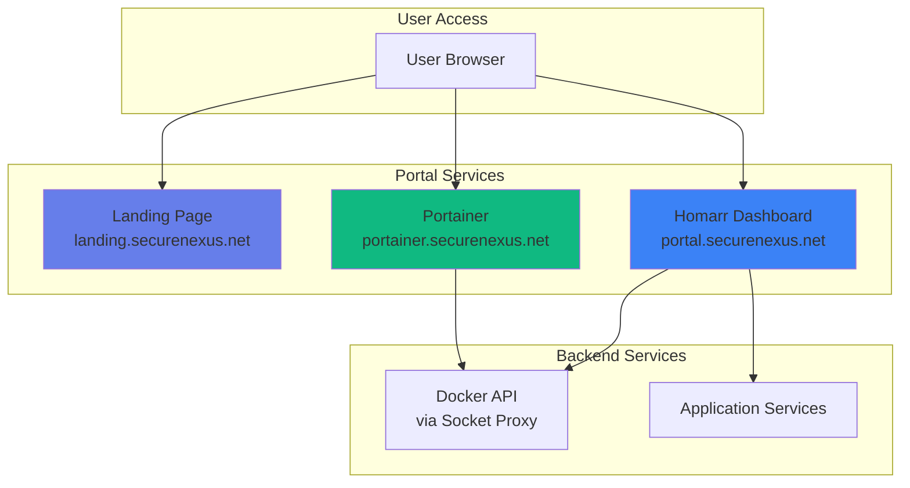

# Portal & UI Overview

Service dashboards, container management, and branding customization.

## Portal Architecture



## Homarr Portal

### What is Homarr?

Homarr is a **customizable dashboard** providing centralized access to all services:

**Features**:
- Visual service dashboard
- Live service status
- Custom widgets
- Integration with monitoring services
- Responsive design
- User-friendly visual editor

**Access**: `https://portal.securenexus.net`

**Authentication**: Public or SSO-protected (configurable)

### Homarr Configuration

**Configuration files**:
```
homepage/config/
├── bookmarks.yaml       # Quick links
├── services.yaml        # Service cards
├── settings.yaml        # General settings
├── widgets.yaml         # Dashboard widgets
└── secrets-example.yaml # API keys template
```

### Service Cards

**Define services** in `homepage/config/services.yaml`:

```yaml
- Group Name:
    - Service Name:
        icon: mdi-icon-name
        href: https://service.securenexus.net
        description: Service description
        ping: https://service.securenexus.net/health
        statusStyle: dot
        widget:
          type: custom
          url: https://service.securenexus.net/api/stats
          mappings:
            - field: uptime
              label: Uptime
              format: percent
```

**Example - ERPNext Card**:
```yaml
- Business Apps:
    - ERPNext:
        icon: mdi-account-cash
        href: https://erp.byrne-accounts.org
        description: Multi-tenant ERP system
        ping: https://erp.byrne-accounts.org
        statusStyle: dot
```

### Widgets

**Available widgets**:
- **Service Status**: Live service health
- **System Resources**: CPU, RAM, disk usage
- **Docker Container**: Container stats
- **Weather**: Local weather
- **Calendar**: Upcoming events
- **Bookmarks**: Quick links
- **Custom**: API-driven data

**Example - System Resources Widget**:
```yaml
- type: resources
  cpu: true
  memory: true
  disk: /
```

### Bookmarks

**Quick links** in `homepage/config/bookmarks.yaml`:

```yaml
- SecureNexus:
    - Documentation:
        - icon: mdi-book
          href: https://docs.securenexus.net
    - Status Page:
        - icon: mdi-heart-pulse
          href: https://status.securenexus.net
    - GitHub:
        - icon: mdi-github
          href: https://github.com/your-org/securenexus
```

### Customization

**Visual Editor**:
1. Click settings icon (top-right)
2. Enable edit mode
3. Drag and drop widgets
4. Add/remove service cards
5. Configure widget settings
6. Save changes

**Manual Configuration**:
1. Edit YAML files in `homepage/config/`
2. Restart Homarr container: `make restart S=homarr`
3. Changes applied immediately

### Integration

**Portainer Integration**:
Homarr can display Docker container stats from Portainer:

```yaml
- type: portainer
  url: https://portainer.securenexus.net
  env: 1
  key: {{HOMEPAGE_VAR_PORTAINER_KEY}}
```

**Documentation**: [Homarr Portainer Integration](../HOMARR_PORTAINER_INTEGRATION.md)

### Migration

**From Homer to Homarr**:

Homarr is the successor to Homer with enhanced features:
- Better UI/UX
- More widgets
- API integrations
- Active development

**Documentation**: [Homarr Migration](../HOMARR_MIGRATION_V1.md)

## Portainer

### What is Portainer?

Portainer is a **Docker container management UI** providing:

**Features**:
- Container lifecycle management (start, stop, restart, delete)
- Image management
- Volume management
- Network management
- Container logs and stats
- Docker Compose stack deployment
- Access control and teams

**Access**: `https://portainer.securenexus.net` (VPN required)

**Why VPN-only**:
- Full control over Docker
- Can delete all containers
- Security-critical access

### Portainer Setup

**Installation** (already configured):

1. Portainer service in `compose.yml`
2. Traefik routing with `admin-vpn` middleware
3. Docker socket access via socket proxy

**First-time Setup**:
1. Connect to Tailscale VPN
2. Visit `https://portainer.securenexus.net`
3. Create admin password
4. Select "Docker Standalone"
5. Connect to Docker via socket

**Documentation**: [Portainer Setup](../PORTAINER_SETUP.md)

### Container Management

**Start/Stop Containers**:
1. Go to Containers
2. Select container(s)
3. Click Start/Stop/Restart/Remove

**View Container Logs**:
1. Click container name
2. Go to "Logs" tab
3. View real-time logs
4. Download logs

**Container Stats**:
1. Click container name
2. Go to "Stats" tab
3. View CPU, memory, network, disk I/O

**Container Console**:
1. Click container name
2. Go to "Console" tab
3. Select shell (sh, bash, etc.)
4. Execute commands interactively

### Stack Management

**Deploy Stack**:
1. Go to Stacks
2. Click "Add stack"
3. Paste docker-compose.yml
4. Configure environment variables
5. Deploy

**Update Stack**:
1. Go to Stacks
2. Click stack name
3. Click "Editor"
4. Modify configuration
5. Click "Update the stack"

### Image Management

**Pull Image**:
1. Go to Images
2. Click "Pull"
3. Enter image name
4. Select tag
5. Pull image

**Remove Unused Images**:
1. Go to Images
2. Filter by "Unused"
3. Select images
4. Click "Remove"

### Volume Management

**Browse Volumes**:
1. Go to Volumes
2. Click volume name
3. View size and mount point

**Backup Volume**:
1. Create container with volume mounted
2. Use `docker cp` to extract data
3. Or use Portainer's built-in backup

### Network Management

**View Networks**:
1. Go to Networks
2. See all Docker networks
3. View connected containers

**Create Network**:
1. Click "Add network"
2. Enter name and driver
3. Configure subnet (if custom)
4. Create

### Access Control

**Create User**:
1. Go to Users
2. Click "Add user"
3. Enter username and password
4. Assign role (admin, standard, read-only)
5. Create

**Teams**:
1. Go to Teams
2. Click "Add team"
3. Add users to team
4. Assign permissions

## Landing Page

### Custom Landing Page

**Static HTML landing** at `https://landing.securenexus.net`

**Purpose**:
- Welcome page
- Quick links
- Company information
- Service directory

**Location**: `landing/index.html`

**Customization**:
1. Edit `landing/index.html`
2. Add custom CSS in `<style>` section
3. Update links and content
4. Restart landing container: `make restart S=landing`

**Features**:
- Responsive design
- Custom branding
- Service links
- Contact information

## Branding Customization

### Authentik Branding

**Custom branding** for SSO login page:

**Assets**:
- Logo: `branding/logo.png` (200x100px)
- CSS: `branding/sn.css`

**Branding Features**:
- SecureNexus logo
- Custom color scheme (blue #3b82f6, green #10b981)
- Gradient backgrounds
- Custom tagline

**Setup**: [Authentik Branding Guide](../AUTHENTIK_BRANDING_GUIDE.md)

**Completion**: [Branding Complete](../BRANDING_COMPLETE.md)

### Logo Preparation

**Logo requirements**:
- PNG format
- Transparent background
- 200x100px (Authentik)
- 800x320px (original, for other uses)

**Resize script**:
```python
# resize_logo.py
from PIL import Image

img = Image.open('branding/logo-800x320-original.png')
resized = img.resize((200, 100), Image.Resampling.LANCZOS)
resized.save('branding/logo-200x100.png')
```

**Documentation**: [Logo Resize Summary](../LOGO_RESIZE_SUMMARY.md)

### Custom CSS

**Authentik Custom CSS** (`branding/sn.css`):

```css
/* Login page background */
.pf-c-login__main {
    background: linear-gradient(135deg, #667eea 0%, #764ba2 100%);
}

/* Logo sizing */
.pf-c-brand {
    max-height: 300px;
}

/* Card styling */
.pf-c-card {
    border: 2px solid transparent;
    border-image: linear-gradient(to right, #3b82f6, #10b981) 1;
}

/* Tagline */
.ak-login-subtitle::after {
    content: "SecureNexus — Secure Infrastructure Platform";
    display: block;
    margin-top: 1rem;
}
```

**Apply to Authentik**:
1. Login to Authentik admin
2. Go to Customization > Branding
3. Upload logo
4. Add custom CSS
5. Save

## .well-known Directory

**Purpose**: Serve `.well-known` files for various protocols

**Service**: `wellknown` container

**Served files**:
- `/.well-known/acme-challenge/` - SSL verification (Traefik)
- `/.well-known/security.txt` - Security contact info
- `/.well-known/openid-configuration` - OIDC discovery (Authentik)

**Location**: `wellknown/` directory

**Add custom file**:
1. Create file in `wellknown/.well-known/`
2. Restart container: `make restart S=wellknown`
3. Access at `https://securenexus.net/.well-known/<filename>`

## Static Brand Assets

**Service**: `brand-static` container

**Purpose**: Serve static branding files (logo, CSS, images)

**Location**: `branding/` directory

**Files**:
- `logo.png` - Main logo
- `logo-200x100.png` - Resized logo
- `logo-800x320-original.png` - Original logo
- `sn.css` - Custom CSS

**Access**: `https://securenexus.net/branding/<filename>`

**Usage**:
- Authentik login page: Served from Traefik static files
- Other services: Can reference via URL

## Best Practices

### Dashboard Organization

**Homarr**:
- Group related services
- Use meaningful icons
- Add descriptions
- Configure status monitoring
- Keep layout clean

### Security

**Portainer**:
- VPN-only access (critical!)
- Strong admin password
- Limit user permissions
- Regular password rotation
- Enable audit logs

**Homarr**:
- Consider SSO if sensitive
- Disable edit mode for users
- Validate widget API URLs
- Regular config backups

### Performance

**Homarr**:
- Limit number of widgets
- Disable unnecessary status checks
- Use caching for API calls
- Optimize images

**Portainer**:
- Limit log retention
- Clean unused images/volumes regularly
- Monitor resource usage

## Troubleshooting

### Homarr Not Loading

**Check**:
1. Container running: `docker compose ps homarr`
2. Traefik routing: `docker compose logs traefik | grep homarr`
3. Configuration valid: Check YAML syntax
4. Browser console: F12 for errors

### Portainer 403 Error

**Cause**: Not connected to Tailscale VPN

**Solution**:
1. Install Tailscale on your device
2. Connect to VPN
3. Retry accessing Portainer
4. Verify IP in Tailscale range (100.64.0.0/10)

### Service Cards Not Working

**Check**:
1. Service URL correct in `services.yaml`
2. Service accessible from Homarr container
3. Ping endpoint responding
4. CORS enabled if using API widget

### Custom Branding Not Applied

**Authentik**:
1. Verify logo uploaded
2. Check CSS syntax
3. Clear browser cache
4. Rebuild Authentik: `make restart S=authentik_server`

**Homarr**:
1. Edit CSS in settings
2. Save changes
3. Hard refresh browser (Ctrl+F5)

## Quick Reference

### Homarr Commands

```bash
# Restart Homarr
make restart S=homarr

# View Homarr logs
docker compose logs homarr -f

# Edit configuration
nano homepage/config/services.yaml

# Validate YAML
yamllint homepage/config/services.yaml
```

### Portainer Commands

```bash
# Restart Portainer
make restart S=portainer

# View Portainer logs
docker compose logs portainer -f

# Reset admin password (requires container restart with flag)
docker run --rm -v portainer_data:/data portainer/helper-reset-password
```

### Branding Updates

```bash
# Update logo
cp new-logo.png branding/logo.png

# Restart brand-static
make restart S=brand-static

# Update Authentik branding
# (via Authentik admin UI)
```

## Next Steps

- **[Homarr Migration](../HOMARR_MIGRATION_V1.md)**: Upgrade from Homer
- **[Portainer Setup](../PORTAINER_SETUP.md)**: Configure container management
- **[Branding Guide](../AUTHENTIK_BRANDING_GUIDE.md)**: Customize Authentik
- **[Monitoring](../monitoring/overview.md)**: Add Homarr widgets
