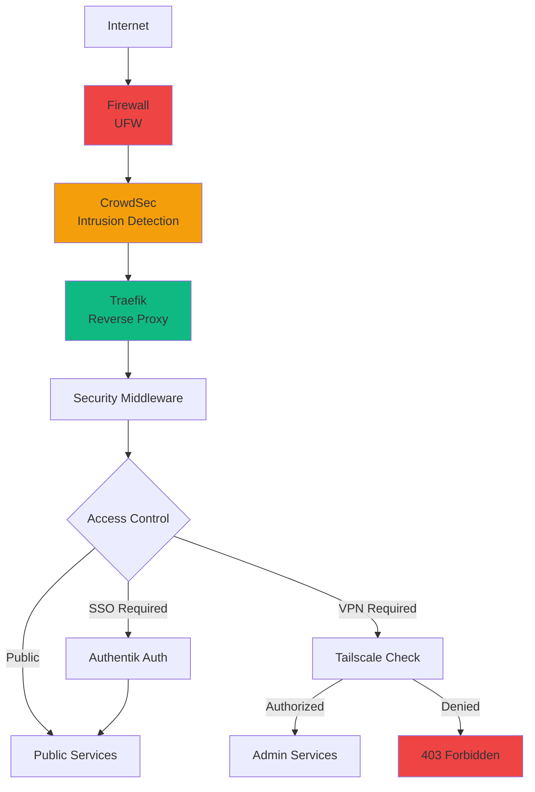

# Security Overview

Comprehensive security architecture and hardening measures for the SecureNexus platform.

## Security Rating

!!! success "Security Grade: A+"
    **Enterprise-level security hardening complete**

    All 7 recommended security measures implemented and verified.

## Security Layers



## Implemented Security Measures

### 1. Automated Backup Rotation ✅

**Status**: Fully operational

**Configuration**:
- **Schedule**: Daily at 2:00 AM (cron)
- **Retention**: 7 daily / 4 weekly / 12 monthly
- **Size**: ~352MB per backup
- **Location**: `/backup/securenexus/{daily,weekly,monthly}/`

**What's Backed Up**:
- PostgreSQL (Authentik) - 5.6M
- MySQL (CoreDNS) - varies
- etcd snapshots - 40K
- Grafana dashboards - 76K
- Prometheus data - 315M
- Loki logs - 30M
- Configuration files
- Secrets (encrypted)
- SSL certificates

**Management**:
```bash
# View backup inventory
ls -lh /backup/securenexus/{daily,weekly,monthly}/

# Check backup log
tail -f /var/log/securenexus-backup.log

# Run manual backup
sudo ./scripts/backup-rotation.sh
```

**Documentation**: [Disaster Recovery](../DISASTER_RECOVERY.md)

### 2. Prometheus Retention Policy ✅

**Configuration**:
- **Retention Time**: 30 days
- **Retention Size**: 50GB max
- **Memory Limit**: 2GB (increased from 1GB)
- **Current Usage**: ~12% (~240MB)

**Benefits**:
- Prevents disk space exhaustion
- Predictable storage requirements
- 30-day historical data for trend analysis
- Automatic cleanup of old metrics

### 3. Comprehensive Alerting ✅

**Alert Rules**: 30+ rules across 11 categories

**Categories**:
1. **Service Availability** (7 rules)
   - Container down
   - High restart rate
   - Service unavailable

2. **Resource Usage** (6 rules)
   - High CPU
   - High memory
   - Low disk space
   - High disk I/O

3. **Authentik** (3 rules)
   - Service failures
   - High login attempts
   - Worker failures

4. **DNS Health** (3 rules)
   - CoreDNS down
   - etcd unreachable
   - High DNS query failure rate

5. **Prometheus** (2 rules)
   - High memory usage
   - Target down

6. **Security Events** (3 rules)
   - CrowdSec anomalies
   - SSH brute-force attempts
   - Failed authentication spikes

7. **Mail Service** (2 rules)
   - Mailcow unavailable
   - High mail queue

8. **Backup Status** (1 rule)
   - Backup failure

9. **SSL Certificates** (1 rule)
   - Certificate expiring (< 7 days)

10. **Network** (1 rule)
    - High error rate

11. **Application Errors** (1 rule)
    - High HTTP 5xx rate

**Configuration**: `monitoring/alert_rules.yml`

### 4. Disaster Recovery Documentation ✅

Comprehensive 400+ line guide covering:
- Complete restoration procedures
- Database recovery (PostgreSQL, MySQL, etcd)
- Volume restoration
- Configuration recovery
- SSL certificate restoration
- Testing procedures
- RTO/RPO targets

**Documentation**: [Disaster Recovery Guide](../DISASTER_RECOVERY.md)

### 5. Multi-Layer Rate Limiting ✅

**Layer 1: UFW Firewall**
```bash
# SSH rate limiting
sudo ufw limit 22/tcp  # Max 6 connections/30s
```

**Layer 2: CrowdSec**
- Intrusion detection
- IP reputation checking
- Automatic banning
- Community blocklists

**Layer 3: Traefik Middleware**
```yaml
http:
  middlewares:
    rate-limit:
      rateLimit:
        average: 100
        burst: 50
```

### 6. Log Rotation ✅

**System Logs**:
```
/etc/logrotate.d/securenexus
- Daily rotation
- 14-day retention
- Compression enabled
- Size limit: 100MB
```

**Docker Logs**:
```json
{
  "log-driver": "json-file",
  "log-opts": {
    "max-size": "10m",
    "max-file": "3"
  }
}
```

**Application Logs**:
- Loki retention: 30 days
- Promtail shipping
- Centralized aggregation

### 7. Secrets Rotation Policy ✅

**Rotation Schedule**:

| Secret Type | Rotation Frequency | Method |
|-------------|-------------------|--------|
| Database passwords | Quarterly | Manual, coordinated |
| API keys | Bi-annually | Regenerate via admin panel |
| OAuth secrets | Annually | Regenerate in Authentik |
| SSH keys | Annually | Generate new, update authorized_keys |
| Tailscale auth key | On-demand | Generate in Tailscale admin |

**Exception**: Authentik secret key (DO NOT ROTATE - breaks sessions)

**Process**:
1. Generate new secret
2. Update `secrets/` file
3. Recreate affected containers
4. Verify functionality
5. Document in change log

## Authentication & SSO

### Authentik Configuration

**Features**:
- OIDC/OAuth2 provider
- LDAP support
- Multi-factor authentication (MFA)
- Custom branding
- User provisioning

**Setup Guides**:
- [SSO Integration Plan](../SSO_INTEGRATION_PLAN.md)
- [Authentik Branding](../AUTHENTIK_BRANDING_GUIDE.md)
- [SSO User Management](../SSO_USER_MANAGEMENT.md)

### ERPNext SSO Integration

**Status**: Configured via OAuth2

**Features**:
- Single sign-on from Authentik
- Automatic user provisioning
- Role mapping
- Seamless authentication

**Setup**: [ERPNext SSO Setup](../ERPNEXT_SSO_SETUP.md)

### OAuth Applications

Configured OAuth clients:
- Grafana (VPN-protected)
- ERPNext (multi-tenant)
- Future: Mailcow webmail, Portainer

## Access Control

### Public Services

**No authentication required**:
- Landing page (landing.securenexus.net)
- Uptime Kuma (status.securenexus.net)

**Middleware**: `secure-headers`, `crowdsec-fa`

### SSO-Protected Services

**Requires Authentik login**:
- Homarr portal (portal.securenexus.net)

**Middleware**: `secure-headers`, `crowdsec-fa`, `sso`

### VPN-Only Services

**Requires Tailscale VPN connection**:
- Grafana (grafana.securenexus.net)
- Prometheus (prometheus.securenexus.net)
- Traefik Dashboard (traefik.securenexus.net)
- Portainer (portainer.securenexus.net)

**Middleware**: `secure-headers`, `admin-vpn`

**IP Whitelist**: `100.64.0.0/10` (Tailscale range)

### Service-Specific Auth

**ERPNext**: Internal authentication (or SSO)
**Mailcow**: Internal authentication
**Authentik**: Internal authentication (initial setup)

## Network Security

### Firewall (UFW)

**Policy**: Deny by default

**Allowed Ports**:
```
22    - SSH (rate-limited: 6 conn/30s)
25    - SMTP
53    - DNS (UDP/TCP)
80    - HTTP (redirect to HTTPS)
143   - IMAP
443   - HTTPS
465   - SMTPS
587   - Submission
853   - DNS-over-TLS
993   - IMAPS
995   - POP3S
41641/udp - Tailscale
```

**Management**:
```bash
# View firewall status
sudo ufw status numbered

# Add rate limiting to SSH (if not already)
sudo ufw limit 22/tcp

# Reload firewall
sudo ufw reload
```

### CrowdSec Protection

**Configuration**: LAPI-only mode

**Features**:
- Real-time intrusion detection
- IP reputation checking
- Automatic IP banning
- Community blocklists
- Traefik bouncer integration

**Security Patterns**:
- SQL injection
- XSS attempts
- Path traversal
- Known CVE exploits
- Brute-force attacks

**Management**:
```bash
# View banned IPs
docker compose exec crowdsec cscli decisions list

# Ban an IP manually
docker compose exec crowdsec cscli decisions add --ip 1.2.3.4 --duration 4h

# Unban an IP
docker compose exec crowdsec cscli decisions delete --ip 1.2.3.4
```

### Security Headers

Applied via `secure-headers` middleware:

```yaml
headers:
  customResponseHeaders:
    X-Frame-Options: "SAMEORIGIN"
    X-Content-Type-Options: "nosniff"
    X-XSS-Protection: "1; mode=block"
    Referrer-Policy: "strict-origin-when-cross-origin"
  stsSeconds: 31536000  # HSTS: 1 year
  stsIncludeSubdomains: true
  stsPreload: true
  contentSecurityPolicy: "default-src 'self'"
```

## SSL/TLS Security

### Certificate Management

**Provider**: Let's Encrypt
**Renewal**: Automatic (30 days before expiry)
**Storage**: `acme/acme.json` (Traefik)

**Certificates**:
- securenexus.net
- *.securenexus.net (wildcard)
- byrne-accounts.org
- *.byrne-accounts.org (wildcard)

**Expiry Monitoring**: Alert 7 days before expiration

### TLS Configuration

**Minimum Version**: TLS 1.2
**Cipher Suites**: Modern, secure ciphers only
**HSTS**: Enabled with 1-year max-age

### Certificate Sync

Mailcow certificate sync:
```bash
# Sync Traefik certificates to Mailcow
./scripts/update-mailcow-certs.sh
```

## Secret Management

### Storage

All secrets stored in `./secrets/` directory:

```
secrets/
├── authentik_secret_key          # 64 hex chars (DO NOT ROTATE)
├── authentik_db_password         # PostgreSQL password
├── mysql_root_password           # MySQL root password
├── mysql_password                # MySQL user password
├── grafana_admin_password        # Grafana admin password
├── grafana_oauth_secret          # OAuth client secret
├── tailscale_authkey.txt         # Tailscale auth key
└── ... (30+ secret files)
```

### Secret Generation

```bash
# Generate all secrets
make secrets

# Verify secrets
ls -la secrets/

# Generate single secret manually
openssl rand -base64 32 > secrets/new_secret.txt
```

### Best Practices

1. **Never commit secrets** to version control
2. **Use strong passwords**: minimum 32 characters
3. **Rotate regularly**: per rotation policy
4. **Encrypt backups**: before off-site storage
5. **Limit access**: chmod 600 on secret files
6. **Document changes**: in change log

## Admin Access

### VPN Setup (Tailscale)

**Required for**:
- Grafana
- Prometheus
- Traefik Dashboard
- Portainer

**Setup**:
1. Install Tailscale on admin device
2. Get auth key from Tailscale admin console
3. Store in `secrets/tailscale_authkey.txt`
4. Deploy with `make up-core`

**Guides**:
- [Tailscale Setup](../VPN_SETUP.md)
- [Tailscale Access Guide](../TAILSCALE_ACCESS_GUIDE.md)
- [Admin VPN Access Fix](../ADMIN_VPN_ACCESS_FIX.md)

### SSH Hardening

**Recommended Settings** (`/etc/ssh/sshd_config`):

```
PermitRootLogin no
PasswordAuthentication no
PubkeyAuthentication yes
ChallengeResponseAuthentication no
UsePAM yes
X11Forwarding no
```

**Additional Security**:
```bash
# Enable SSH rate limiting
sudo ufw limit 22/tcp

# Install fail2ban (optional)
sudo apt install fail2ban

# Configure fail2ban for SSH
sudo systemctl enable fail2ban
```

## Security Monitoring

### Grafana Dashboards

**Security Dashboard** includes:
- Failed authentication attempts
- Banned IPs (CrowdSec)
- Firewall blocks
- SSL certificate status
- Unusual traffic patterns

### Alert Channels

Configure in `monitoring/alertmanager.yml`:
- Email notifications
- Slack/Discord webhooks
- PagerDuty integration
- Custom webhooks

### Log Analysis

**Centralized Logging** (Loki):
- All container logs
- System logs (journald)
- Application logs
- Audit logs

**Query Examples**:
```logql
# Failed SSH logins
{job="syslog"} |= "Failed password"

# CrowdSec bans
{container_name="crowdsec"} |= "ban"

# HTTP 5xx errors
{job="traefik"} | json | status >= 500
```

## Security Checklist

### Pre-Deployment

- [ ] Change all default passwords
- [ ] Configure firewall rules
- [ ] Generate unique secrets
- [ ] Set up Tailscale VPN
- [ ] Configure backups
- [ ] Review access controls

### Post-Deployment

- [ ] Verify SSL certificates
- [ ] Test backup restoration
- [ ] Configure alert channels
- [ ] Document custom changes
- [ ] Train admin users
- [ ] Schedule security audits

### Monthly Maintenance

- [ ] Review access logs
- [ ] Check banned IPs
- [ ] Verify backup success
- [ ] Test disaster recovery
- [ ] Update documentation
- [ ] Review alert rules

### Quarterly Tasks

- [ ] Rotate database passwords
- [ ] Review user accounts
- [ ] Update dependencies
- [ ] Security audit
- [ ] Penetration testing (optional)

## Compliance

### Data Protection

- **Encryption at Rest**: Database volumes encrypted
- **Encryption in Transit**: TLS 1.2+ for all connections
- **Backup Encryption**: Encrypted before off-site storage
- **Access Logs**: Retained for 30 days

### Audit Trail

- **Authentication Events**: Logged in Authentik
- **Administrative Actions**: Logged in respective services
- **System Changes**: Git tracked configuration
- **Backup Operations**: Logged to `/var/log/securenexus-backup.log`

## Incident Response

### Security Incident Procedure

1. **Detect**: Monitor alerts and logs
2. **Contain**: Block malicious IPs, isolate affected services
3. **Investigate**: Review logs, identify attack vector
4. **Remediate**: Patch vulnerabilities, update configurations
5. **Recover**: Restore from backups if needed
6. **Document**: Record incident details and response
7. **Review**: Update security measures

### Emergency Contacts

Document your security team contacts:
- Primary admin: _______
- Secondary admin: _______
- Hosting provider: _______
- Domain registrar: _______

## Next Steps

- **[Disaster Recovery](../DISASTER_RECOVERY.md)**: Complete recovery procedures
- **[Security Hardening Guide](../SECURITY_HARDENING_GUIDE.md)**: Detailed hardening steps
- **[Infrastructure Overview](../infrastructure/overview.md)**: Network and firewall details
- **[Monitoring Overview](../monitoring/overview.md)**: Security dashboards and alerts
